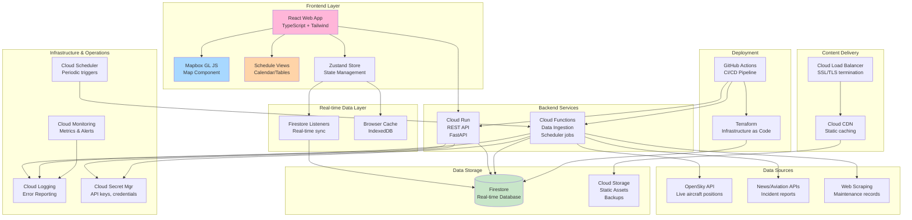

# Qantas Aircraft Tracker - Architecture Design Document

**Version:** 1.0
**Date:** March 20, 2026
**Status:** Ready for Claude Code Implementation

---

## Table of Contents

1. [Executive Summary](#executive-summary)
2. [System Architecture](#system-architecture)
3. [Technology Stack & Justification](#technology-stack--justification)
4. [Data Architecture](#data-architecture)
5. [API Specification](#api-specification)
6. [Frontend Architecture](#frontend-architecture)
7. [Visual Design System](#visual-design-system)
8. [Schedule & Route Visualization](#schedule--route-visualization)
9. [Data Integration Strategy](#data-integration-strategy)
10. [CI/CD & Deployment Pipeline](#cicd--deployment-pipeline)
11. [Security & Secrets Management](#security--secrets-management)
12. [Performance & Scalability](#performance--scalability)
13. [Local Development Environment](#local-development-environment)
14. [Cost Analysis & Optimization](#cost-analysis--optimization)
15. [Risk Analysis & Mitigation](#risk-analysis--mitigation)
16. [Rollout & Deployment Strategy](#rollout--deployment-strategy)
17. [Handoff to Claude Code](#handoff-to-claude-code)
18. [Documentation & Operational Guides](#documentation--operational-guides)

---

## Executive Summary

### Project Overview

The **Qantas Aircraft Tracker** is a public-facing, serverless web application that provides real-time visualization of Qantas Boeing 787 and Airbus A380 aircraft locations on an interactive map, combined with a comprehensive schedule view of widebody routes.

**Key Objectives:**
- Display live aircraft positions aggregated from OpenSky Network API
- Show scheduled flight operations with route visualization
- Incorporate maintenance history and incident data from public sources
- Provide a modern, responsive interface with a pastel color aesthetic
- Enable complete GitHub Actions CI/CD deployment to Google Cloud Platform

### Key Technical Decisions

| Decision | Rationale |
|----------|-----------|
| **Frontend Framework** | React with TypeScript for type safety and component reusability |
| **Map Library** | Mapbox GL JS for high-performance rendering of aircraft and routes |
| **Backend** | Python (FastAPI) for data ingestion and API; Cloud Functions/Cloud Run for serverless execution |
| **Database** | Firestore (NoSQL) for real-time capabilities and scalability without ops overhead |
| **Infrastructure** | Google Cloud Platform (Cloud Functions, Cloud Run, Cloud Scheduler, Firestore, CDN) |
| **IaC Tool** | Terraform for reproducible infrastructure management and versioning |
| **CI/CD** | GitHub Actions with automated testing, security scanning, and multi-stage deployment |
| **Deployment Strategy** | Blue-green deployments to staging, then direct production deployment with rapid rollback capability |
| **State Management** | Zustand for global state + Firestore listeners for real-time data sync |
| **Styling** | Tailwind CSS for utility-first styling with custom pastel color palette |

### High-Level Architecture

```
┌─────────────────────────────────────────────────────────────────────┐
│                         USERS (Internet)                             │
└──────────────────────────┬──────────────────────────────────────────┘
                           │ HTTPS
                           ↓
┌─────────────────────────────────────────────────────────────────────┐
│                    Google Cloud CDN / Load Balancer                  │
│              (Static assets, caching, DDoS protection)              │
└──────────────────────────┬──────────────────────────────────────────┘
                           │
        ┌──────────────────┼──────────────────┐
        │                  │                  │
        ↓                  ↓                  ↓
    ┌────────────┐  ┌────────────┐  ┌──────────────────┐
    │ Cloud      │  │ Cloud      │  │ Cloud Storage    │
    │ Functions  │  │ Run        │  │ (Static Assets)  │
    │            │  │            │  │ + Cloud CDN      │
    │ Data       │  │ REST API   │  └──────────────────┘
    │ Ingestion  │  │ Server     │
    └─────┬──────┘  └─────┬──────┘
          │                │
          │   Firestore    │
          │   Read/Write   │
          │                │
          └────────┬───────┘
                   │
          ┌────────↓────────┐
          │   Firestore     │
          │                 │
          │ Collections:    │
          │ • aircraft_...  │
          │ • routes_...    │
          │ • incidents_... │
          │ • maintenance_..│
          └─────────────────┘

┌─────────────────────────────────────────────────────────────────────┐
│                        External Data Sources                         │
├─────────────────────────────────────────────────────────────────────┤
│ OpenSky API │ Aviation Safety Network │ Qantas Press Releases │ etc │
└─────────────────────────────────────────────────────────────────────┘
       ↑
       │ Cloud Scheduler (periodic jobs)
       │
       └─ Cloud Functions (data ingestion & transformation)
```

### Success Criteria

- **Performance:** Frontend load time < 2 seconds; API response < 1 second
- **Availability:** 99.5% uptime SLA
- **Data Freshness:** Aircraft positions updated every 10-15 seconds
- **Scalability:** Support 1,000+ concurrent users without degradation
- **Cost:** Operate within GCP free tier with minimal incremental costs
- **Maintainability:** Code follows standards; infrastructure as code; comprehensive documentation

---

## System Architecture

### Complete System Architecture Diagram



### Data Flow: From Source to Frontend

**Real-time Aircraft Positions:**
1. Cloud Scheduler triggers data ingestion Cloud Function every 10 seconds
2. Cloud Function queries OpenSky API for Qantas aircraft (filtered by ICAO operators)
3. Data validated, normalized, and transformed
4. Position data written to `aircraft_live_positions/{icao}` in Firestore
5. Frontend Firestore listeners detect changes in real-time
6. Map markers update with new positions and status
7. Previous positions cached in browser IndexedDB for history/trails

**Scheduled Flights:**
1. Daily Cloud Function parses Qantas published schedules
2. Routes and flight times stored in `scheduled_flights` collection
3. Calendar view queries Firestore for flights in selected date range
4. Real-time status update: Cloud Function compares scheduled vs. actual (OpenSky data)
5. Frontend updates flight status as aircraft progress

**Maintenance & Incidents:**
1. Weekly Cloud Function scrapes public sources (ATSB, Aviation Safety Network, etc.)
2. Data parsed and deduplicated by aircraft registration
3. Stored in `maintenance_history` and `incidents` collections
4. Aircraft detail pages query relevant records for display

### Service Communication Patterns

**Synchronous (Request-Response):**
- Frontend ↔ Cloud Run API (REST endpoints)
- Cloud Run ↔ Firestore (single operations, transactions)
- Cloud Run ↔ External APIs (OpenSky, News APIs)

**Asynchronous (Event-Driven):**
- Cloud Scheduler → Cloud Functions (cron-triggered data ingestion)
- Firestore → Frontend (real-time listeners with push updates)
- Cloud Logging → Cloud Monitoring (event aggregation and alerting)

### Scaling Assumptions & Constraints

**Expected Load:**
- **Peak Concurrent Users:** 1,000
- **API Requests per Second:** ~100 RPS during peak
- **Firestore Operations:**
  - Peak write throughput: 200 writes/sec (aircraft position updates)
  - Peak read throughput: 500 reads/sec (frontend queries + API calls)
- **Data Volume:**
  - ~50-100 Qantas widebody aircraft tracked
  - Position history: 48 hours retention (smallest TTL)
  - Maintenance records: 5-10 years retention

**Firestore Autoscaling:**
- Firestore automatically scales for read/write throughput
- Indexed queries ensure < 500ms response times
- Real-time listeners create long-lived connections; Cloud Run can handle 100+ concurrent connections per instance

**Cloud Functions Scaling:**
- Automatically scales from 0 to N instances based on queue
- Each function execution: ~2 seconds (API call + processing + Firestore write)
- Rate limit compliance: OpenSky free tier allows 400 requests/hour (one aircraft per request); use batch queries where available

**Frontend Scalability:**
- Static assets served from CDN (Cloud Storage + Cloud CDN)
- Frontend bundle size target: < 500KB gzipped
- Lazy load map and schedule components to improve initial load

### Backup & Disaster Recovery Strategy

**Data Backup:**
- Firestore automated backups enabled for all collections
- Backup retention: 35 days (Google-managed)
- Point-in-time restore available for data recovery

**Disaster Recovery Procedures:**
- **RTO (Recovery Time Objective):** < 1 hour
- **RPO (Recovery Point Objective):** < 5 minutes
- **Process:**
  1. GitHub repo is source of truth for all code and IaC
  2. Terraform state stored in GCS bucket with versioning enabled
  3. In event of data loss: restore from Firestore backup
  4. In event of service failure: redeploy infrastructure via GitHub Actions + Terraform
  5. Database restoration can be automated via Cloud Function

**Failover Strategy:**
- No multi-region failover for MVP (single-region GCP project)
- Future enhancement: replicate Firestore to secondary region for HA
- CDN caching ensures API availability even if backend briefly unavailable

---

## Technology Stack & Justification

### Frontend Stack

| Technology | Version | Purpose | Justification |
|------------|---------|---------|---------------|
| React | 18+ | UI framework | Industry standard, large ecosystem, excellent tooling |
| TypeScript | 5+ | Type safety | Catches errors early; improves IDE support and refactoring |
| Vite | 5+ | Build tool | Fast builds, optimized production bundles, ES modules native |
| Mapbox GL JS | 2.15+ | Interactive maps | High-performance vector rendering; supports 3D; animations |
| TanStack Query | v5 | Data fetching | Handles API caching, background refetching, stale state mgmt |
| Zustand | 4+ | State management | Minimal boilerplate; lightweight; Firestore listener integration |
| Tailwind CSS | 3+ | Utility styling | Consistency with design system; responsive utilities; fast dev |
| Recharts | 2+ | Data visualization | Simple charting for analytics; responsive by default |
| date-fns | 2+ | Date handling | Lightweight; timezone support; schedule calculations |
| lucide-react | 0.38+ | Icons | Modern, open-source SVG icons in pastel colors |

**Why React over Vue/Svelte?**
- Largest ecosystem and community support
- Best integration with Mapbox GL JS
- Strong TypeScript support
- Easier onboarding for new developers

### Backend Stack

| Technology | Version | Purpose | Justification |
|------------|---------|---------|---------------|
| Python | 3.11+ | Runtime | Fast iteration; strong data processing libs; ecosystem depth |
| FastAPI | 0.100+ | API framework | Fast, modern; automatic OpenAPI docs; async support |
| Pydantic | 2+ | Data validation | Type-safe validation; JSON schema generation |
| Google Cloud | Latest | Cloud SDK | Official integration with GCP services |
| Requests | 2.31+ | HTTP client | Reliable, well-tested; connection pooling |
| APScheduler | 3.10+ | Job scheduling | Flexible scheduling; perfect for local development testing |

**Why FastAPI over Flask/Django?**
- Modern async framework (better concurrency)
- Automatic OpenAPI documentation
- Pydantic integration for type safety
- Better performance for high-throughput APIs

### Cloud Platform: Google Cloud Platform

**Rationale for GCP:**
- **Cloud Functions:** Minimal operations overhead; pay-per-invocation pricing
- **Cloud Run:** Containers with auto-scaling; good for REST API server
- **Firestore:** Real-time, scalable NoSQL; excellent for location data
- **Cloud Scheduler:** Serverless cron jobs; integrated with Cloud Functions
- **Cloud CDN:** Global edge locations; automatic caching; DDoS protection
- **Cloud Logging:** Centralized logging with built-in error reporting
- **Artifact Registry:** Private container registry; integrated with Cloud Build
- **Cloud Secret Manager:** Secure credential storage with audit logging

**Why Firestore over alternatives:**
- Real-time listeners → Frontend auto-updates without polling
- Automatic scaling → No capacity planning needed
- Sub-second consistency for reads (mostly)
- Built-in TTL policies for auto-cleanup of old data
- Zero operational overhead

### Infrastructure as Code: Terraform

**Benefits:**
- Version-controlled infrastructure
- Reproducible deployments
- Environment separation (dev/staging/prod)
- State file tracks actual vs. desired state
- Integration with GitHub Actions for automated deployment

**Terraform Modules:**
```
infrastructure/
├── main.tf
├── variables.tf
├── outputs.tf
├── terraform.tfvars (gitignored)
├── backend.tf (GCS bucket for state)
├── modules/
│   ├── firestore/
│   ├── cloud_functions/
│   ├── cloud_run/
│   ├── cloud_scheduler/
│   ├── cloud_storage/
│   └── iam/
└── environments/
    ├── dev/
    ├── staging/
    └── prod/
```

### Development Tools

| Tool | Purpose |
|------|---------|
| Docker | Local development environment consistency |
| Docker Compose | Multi-service orchestration locally |
| Firebase Emulator Suite | Local Firestore, Functions, Hosting emulation |
| Jest | Frontend unit testing |
| Pytest | Backend unit and integration testing |
| ESLint + Prettier | Code linting and formatting (frontend) |
| Black + isort | Code formatting (backend) |
| GitHub Actions | CI/CD pipeline; automated testing and deployment |

---

## Data Architecture

### Firestore Collections & Schema

#### 1. `aircraft_metadata`

Stores static information about each aircraft in the Qantas fleet.

**Document ID:** Aircraft ICAO hex code (e.g., `7CF8A7`)

```json
{
  "icao_hex": "7CF8A7",
  "registration": "VH-ZNA",
  "aircraft_type": "B787-9",
  "manufacturer": "Boeing",
  "serial_number": "35843",
  "delivery_date": "2020-03-15",
  "first_flight_date": "2020-02-18",
  "operator_history": [
    {
      "operator": "Qantas Airways",
      "start_date": "2020-03-15",
      "end_date": null
    }
  ],
  "airframe_hours": 12450.5,
  "cycle_count": 4230,
  "max_range_km": 14685,
  "seat_configuration": "LAYOUT_B787_236",
  "active": true,
  "last_updated": "2026-03-20T10:30:00Z"
}
```

**Indexing:** Composite index on `aircraft_type` + `active` + `last_updated`
**TTL:** None (permanent storage)
**Update Frequency:** Monthly or on aircraft changes

---

#### 2. `aircraft_live_positions`

Real-time position data for active aircraft. Updated every 10-15 seconds by Cloud Function.

**Document ID:** Aircraft ICAO hex code

```json
{
  "icao_hex": "7CF8A7",
  "registration": "VH-ZNA",
  "aircraft_type": "B787-9",
  "latitude": -33.9249,
  "longitude": 151.1754,
  "altitude_ft": 28000,
  "altitude_m": 8534,
  "ground_speed_knots": 485,
  "ground_speed_kmh": 898,
  "heading": 247,
  "vertical_rate_ft_min": 1200,
  "timestamp": "2026-03-20T10:35:42Z",
  "last_position_update": "2026-03-20T10:35:42Z",
  "flight_number": "QF7",
  "origin_iata": "SYD",
  "destination_iata": "LAX",
  "source_api": "opensky",
  "position_accuracy_m": 100,
  "on_ground": false
}
```

**Indexing:** Compound index on `timestamp` + `aircraft_type`
**TTL:** 48 hours (auto-delete old positions)
**Update Frequency:** Every 10 seconds

---

#### 3. `aircraft_trail_history`

Historical position points for drawing aircraft trails on map. Older data aggregated/sampled.

**Collection Path:** `aircraft_live_positions/{icao}/trail_history`
**Document ID:** Timestamp-based (e.g., `20260320_103500Z`)

```json
{
  "timestamp": "2026-03-20T10:35:00Z",
  "latitude": -33.9245,
  "longitude": 151.1750,
  "altitude_ft": 27950
}
```

**Indexing:** Index on `timestamp` for range queries
**TTL:** 24 hours
**Update Frequency:** Every position update (sampled every 30 seconds for storage)

---

#### 4. `routes`

Qantas widebody routes and metadata.

**Document ID:** Route code (e.g., `SYD-LAX`)

```json
{
  "route_code": "SYD-LAX",
  "origin_iata": "SYD",
  "origin_name": "Sydney Kingsford Smith",
  "destination_iata": "LAX",
  "destination_name": "Los Angeles International",
  "distance_km": 12051,
  "distance_nm": 6508,
  "typical_duration_hours": 15.5,
  "aircraft_types": ["B787-9", "B787-10"],
  "frequency_per_week": 4,
  "timezone_departure": "Australia/Sydney",
  "timezone_arrival": "America/Los_Angeles",
  "great_circle_path": [
    { "lat": -33.9249, "lon": 151.1754 },
    { "lat": -34.1234, "lon": 150.8765 }
  ],
  "seasonal_variations": [
    {
      "season": "summer",
      "start_month": 12,
      "end_month": 2,
      "frequency_adjustment": 1.2
    }
  ],
  "active": true,
  "last_updated": "2026-03-01T00:00:00Z"
}
```

**Indexing:** Index on `active`
**TTL:** None
**Update Frequency:** Monthly

---

#### 5. `scheduled_flights`

Scheduled flight information for tracking route operations.

**Document ID:** Auto-generated (e.g., `20260320_QF007_B787_9_7CF8A7`)

```json
{
  "flight_date": "2026-03-20",
  "flight_number": "QF7",
  "route_code": "SYD-LAX",
  "origin_iata": "SYD",
  "destination_iata": "LAX",
  "aircraft_registration": "VH-ZNA",
  "aircraft_type": "B787-9",
  "icao_hex": "7CF8A7",
  "scheduled_departure": "2026-03-20T22:00:00+10:00",
  "scheduled_arrival": "2026-03-20T17:45:00-07:00",
  "actual_departure": null,
  "actual_arrival": null,
  "estimated_arrival": null,
  "status": "scheduled",
  "status_history": [
    {
      "status": "scheduled",
      "timestamp": "2026-03-15T00:00:00Z"
    }
  ],
  "delay_minutes": null,
  "codeshare_flights": [],
  "notes": "",
  "last_updated": "2026-03-20T10:30:00Z"
}
```

**Statuses:** `scheduled`, `active`, `completed`, `delayed`, `cancelled`
**Indexing:** Composite on `flight_date` + `status` + `origin_iata`
**TTL:** 90 days (archive old flights)
**Update Frequency:** Hourly (status checks), real-time (when flight status changes)

---

#### 6. `maintenance_history`

Maintenance records, service bulletins, and aircraft service history.

**Document ID:** Auto-generated unique ID

```json
{
  "aircraft_registration": "VH-ZNA",
  "icao_hex": "7CF8A7",
  "maintenance_type": "heavy_overhaul",
  "service_type": "C-Check",
  "start_date": "2025-11-15",
  "end_date": "2025-12-20",
  "duration_days": 35,
  "location": "Brisbane Heavy Maintenance Centre",
  "description": "Comprehensive C-Check including structural inspection",
  "airframe_hours_at_service": 10200,
  "airframe_hours_added": null,
  "completed": true,
  "source": "qantas_press_release",
  "source_url": "https://example.com/press-release",
  "confidence_score": 0.95,
  "tags": ["structural_inspection", "overhaul"],
  "attachments": [],
  "created_at": "2025-11-15T00:00:00Z",
  "last_updated": "2025-12-20T00:00:00Z"
}
```

**Maintenance Types:** `heavy_overhaul`, `c_check`, `a_check`, `service`, `repair`, `refurbishment`, `mod_installation`
**Indexing:** Composite on `aircraft_registration` + `end_date` (descending)
**TTL:** None (7-year retention)
**Update Frequency:** Weekly scrape of public sources

---

#### 7. `incidents`

Aviation incident reports and safety-related events.

**Document ID:** Auto-generated unique ID

```json
{
  "aircraft_registration": "VH-ZNA",
  "icao_hex": "7CF8A7",
  "incident_date": "2024-08-15",
  "incident_type": "technical_issue",
  "incident_title": "Engine bleed valve issue on departure",
  "description": "Engine bleed valve malfunction resulted in cabin pressure irregularity",
  "severity": "medium",
  "classification": "ATSB_Investigation_Ongoing",
  "atsb_reference": "AO-2024-087",
  "aviation_safety_network_ref": "ASN_12345",
  "outcome": "Aircraft returned to origin for investigation and repair",
  "fatalities": 0,
  "injuries": 0,
  "source": "atsb",
  "source_urls": [
    "https://www.atsb.gov.au/publications/investigation_reports/..."
  ],
  "confidence_score": 0.99,
  "tags": ["engine", "technical_issue"],
  "created_at": "2024-08-15T00:00:00Z",
  "last_updated": "2024-08-20T00:00:00Z"
}
```

**Severity Levels:** `low`, `medium`, `high`, `critical`
**Indexing:** Composite on `aircraft_registration` + `incident_date` (descending)
**TTL:** None (permanent retention)
**Update Frequency:** Daily scan of public sources

---

#### 8. `aircraft_status_aggregate`

Computed denormalized view of current aircraft status (for efficient queries).

**Document ID:** Aircraft ICAO hex code

```json
{
  "icao_hex": "7CF8A7",
  "registration": "VH-ZNA",
  "current_status": "airborne",
  "current_position": {
    "latitude": -33.9249,
    "longitude": 151.1754,
    "timestamp": "2026-03-20T10:35:42Z"
  },
  "current_flight": "QF7",
  "next_scheduled_flight": "QF10",
  "next_scheduled_departure": "2026-03-21T10:00:00Z",
  "maintenance_status": "active",
  "recent_incidents_count": 1,
  "last_position_update": "2026-03-20T10:35:42Z",
  "is_tracked": true
}
```

**Purpose:** Denormalized for quick status lookups on dashboard/list views
**TTL:** None
**Update Frequency:** Real-time (updated whenever base collections change)

---

### Data Relationships & Queries

```
aircraft_metadata --1:N--> aircraft_live_positions
                   |
                   +--1:N--> maintenance_history
                   |
                   +--1:N--> incidents
                   |
                   +--1:N--> aircraft_status_aggregate

routes --1:N--> scheduled_flights
  |
  +--M:N--> aircraft_metadata (via aircraft_type field in both)

scheduled_flights --0:1--> aircraft_live_positions (via icao_hex)
                   |
                   +--0:1--> aircraft_metadata (via icao_hex)
```

### Indexing Strategy

**Composite Indexes Required:**

| Collection | Fields | Purpose |
|------------|--------|---------|
| `aircraft_live_positions` | `timestamp DESC`, `aircraft_type` | Recent positions filtered by type |
| `scheduled_flights` | `flight_date`, `status`, `origin_iata` | Filter flights by date/status/route |
| `maintenance_history` | `aircraft_registration`, `end_date DESC` | Aircraft maintenance timeline |
| `incidents` | `aircraft_registration`, `incident_date DESC` | Incident history per aircraft |
| `aircraft_live_positions` | `timestamp`, `on_ground` | Filter active vs. parked aircraft |

Firestore automatically creates single-field indexes; complex queries need composite indexes in Terraform.

### Data Retention & TTL Policies

| Collection | TTL | Rationale |
|------------|-----|-----------|
| `aircraft_live_positions` | 48 hours | Keep only recent positions; archive trails |
| `aircraft_trail_history` | 24 hours | Historical trail data for map display |
| `aircraft_metadata` | None | Fleet registry; permanent |
| `routes` | None | Route definitions; permanent |
| `scheduled_flights` | 90 days | Archive old schedule data |
| `maintenance_history` | None | Regulatory compliance (7-year retention) |
| `incidents` | None | Safety records; permanent retention |
| `aircraft_status_aggregate` | None | Always current; regenerated real-time |

**TTL Implementation:** Use Firestore TTL policy field with automatic deletion.

### Data Consistency & Deduplication

**Position Data Deduplication:**
- Check if timestamp is within 5 seconds of last stored position
- If yes, update existing document (avoid duplicate writes)
- Calculate speed/heading from position delta for validation

**Maintenance Record Deduplication:**
- Check existing records for same aircraft + date + type
- Use source URL as unique identifier
- If duplicate found, merge confidence scores and sources

**Incident Report Deduplication:**
- Cross-reference ATSB, ASN, and aviation databases
- Use incident date + aircraft + description hash to detect duplicates
- Merge records from multiple sources; prioritize official sources

---

## API Specification

### REST API Endpoints (Cloud Run)

#### **GET /api/v1/health**

Health check endpoint for monitoring and load balancer.

**Response:**
```json
{
  "status": "ok",
  "timestamp": "2026-03-20T10:35:42Z",
  "services": {
    "firestore": "ok",
    "opensky_api": "ok"
  }
}
```

**Status Codes:** `200 OK`, `503 Service Unavailable`

---

#### **GET /api/v1/aircraft**

List all tracked aircraft with current status.

**Query Parameters:**
```
?type=B787-9        (filter by aircraft type)
?active=true        (filter by active status)
?limit=100          (default: 50, max: 500)
?offset=0           (pagination)
```

**Response:**
```json
{
  "data": [
    {
      "icao_hex": "7CF8A7",
      "registration": "VH-ZNA",
      "aircraft_type": "B787-9",
      "current_position": {
        "latitude": -33.9249,
        "longitude": 151.1754,
        "altitude_ft": 28000,
        "heading": 247,
        "speed_knots": 485
      },
      "current_flight": "QF7",
      "status": "airborne",
      "last_position_update": "2026-03-20T10:35:42Z"
    }
  ],
  "pagination": {
    "total": 85,
    "offset": 0,
    "limit": 50,
    "next_offset": 50
  }
}
```

**Status Codes:** `200 OK`, `400 Bad Request`

---

#### **GET /api/v1/aircraft/{icao_hex}**

Get detailed information for a specific aircraft.

**Response:**
```json
{
  "metadata": {
    "icao_hex": "7CF8A7",
    "registration": "VH-ZNA",
    "aircraft_type": "B787-9",
    "manufacturer": "Boeing",
    "serial_number": "35843",
    "delivery_date": "2020-03-15",
    "airframe_hours": 12450.5
  },
  "current_position": {
    "latitude": -33.9249,
    "longitude": 151.1754,
    "altitude_ft": 28000,
    "ground_speed_knots": 485,
    "heading": 247,
    "timestamp": "2026-03-20T10:35:42Z"
  },
  "flight_info": {
    "flight_number": "QF7",
    "origin": "SYD",
    "destination": "LAX",
    "scheduled_departure": "2026-03-20T22:00:00Z",
    "estimated_arrival": "2026-03-20T17:45:00Z"
  },
  "maintenance": {
    "status": "active",
    "last_service_date": "2025-12-20",
    "next_scheduled_service": null,
    "hours_since_last_service": 2250.5
  },
  "incidents": [
    {
      "id": "incident_123",
      "date": "2024-08-15",
      "type": "technical_issue",
      "severity": "medium",
      "title": "Engine bleed valve issue"
    }
  ]
}
```

**Status Codes:** `200 OK`, `404 Not Found`

---

#### **GET /api/v1/aircraft/{icao_hex}/trail**

Get historical position trail for aircraft (last 24 hours).

**Query Parameters:**
```
?hours=24           (default: 24, max: 48)
?sample_interval_sec=300  (sample every N seconds; default: auto)
```

**Response:**
```json
{
  "icao_hex": "7CF8A7",
  "registration": "VH-ZNA",
  "trail": [
    {
      "latitude": -33.9245,
      "longitude": 151.1750,
      "altitude_ft": 27950,
      "timestamp": "2026-03-20T10:30:00Z"
    }
  ]
}
```

---

#### **GET /api/v1/routes**

Get all Qantas widebody routes.

**Query Parameters:**
```
?active=true
?limit=100
?offset=0
```

**Response:**
```json
{
  "data": [
    {
      "route_code": "SYD-LAX",
      "origin": "SYD",
      "destination": "LAX",
      "distance_km": 12051,
      "typical_duration_hours": 15.5,
      "aircraft_types": ["B787-9"],
      "frequency_per_week": 4,
      "great_circle_path": [/* GeoJSON */]
    }
  ],
  "pagination": { /* ... */ }
}
```

---

#### **GET /api/v1/routes/{route_code}/flights**

Get scheduled flights for a route.

**Query Parameters:**
```
?start_date=2026-03-20
?end_date=2026-03-27
?status=scheduled,active,completed
```

**Response:**
```json
{
  "route_code": "SYD-LAX",
  "flights": [
    {
      "flight_date": "2026-03-20",
      "flight_number": "QF7",
      "aircraft_registration": "VH-ZNA",
      "scheduled_departure": "2026-03-20T22:00:00Z",
      "scheduled_arrival": "2026-03-20T17:45:00Z",
      "status": "active",
      "estimated_arrival": "2026-03-20T17:50:00Z"
    }
  ]
}
```

---

#### **GET /api/v1/aircraft/{icao_hex}/maintenance**

Get maintenance history for aircraft.

**Query Parameters:**
```
?limit=50
?offset=0
?start_date=2020-01-01
?end_date=2026-03-20
```

**Response:**
```json
{
  "icao_hex": "7CF8A7",
  "registration": "VH-ZNA",
  "maintenance_records": [
    {
      "id": "maint_001",
      "service_type": "C-Check",
      "start_date": "2025-11-15",
      "end_date": "2025-12-20",
      "location": "Brisbane Heavy Maintenance Centre",
      "duration_days": 35,
      "description": "Comprehensive C-Check"
    }
  ]
}
```

---

#### **GET /api/v1/aircraft/{icao_hex}/incidents**

Get incident reports for aircraft.

**Response:**
```json
{
  "icao_hex": "7CF8A7",
  "registration": "VH-ZNA",
  "incidents": [
    {
      "id": "incident_001",
      "date": "2024-08-15",
      "type": "technical_issue",
      "severity": "medium",
      "title": "Engine bleed valve issue",
      "atsb_reference": "AO-2024-087",
      "source": "atsb"
    }
  ]
}
```

---

### API Error Handling

All endpoints return standardized error responses:

```json
{
  "error": {
    "code": "INVALID_PARAMETER",
    "message": "Invalid aircraft type filter",
    "details": {
      "parameter": "type",
      "value": "B999-9",
      "valid_values": ["B787-9", "B787-10", "A380-800"]
    },
    "timestamp": "2026-03-20T10:35:42Z",
    "request_id": "req_abc123xyz"
  }
}
```

**Standard Status Codes:**
- `200 OK`: Successful request
- `400 Bad Request`: Invalid parameters or malformed request
- `404 Not Found`: Resource not found
- `429 Too Many Requests`: Rate limit exceeded
- `500 Internal Server Error`: Server error (rare; check logs)
- `503 Service Unavailable`: Dependency unavailable (OpenSky API, Firestore)

**Rate Limiting:**
- 100 requests per IP address per minute (Cloud Armor)
- Backpressure response: `Retry-After` header indicates when to retry

---

### API Authentication & Security

**Authentication:** Public API (no authentication required)
**Authorization:** All users see the same data; no user accounts

**Security Headers:**
```
Strict-Transport-Security: max-age=31536000; includeSubDomains
X-Content-Type-Options: nosniff
X-Frame-Options: DENY
Content-Security-Policy: default-src 'self'; script-src 'self'
```

**CORS Policy:**
```
Access-Control-Allow-Origin: *
Access-Control-Allow-Methods: GET, OPTIONS
Access-Control-Allow-Headers: Content-Type
Access-Control-Max-Age: 86400
```

---

## Frontend Architecture

### Component Hierarchy

```
App (root)
├── Header
│   ├── Logo
│   ├── Navigation
│   │   ├── MapView (route)
│   │   ├── ScheduleView (route)
│   │   ├── FleetView (route)
│   │   └── AboutView (route)
│   └── ThemeToggle (future)
│
├── MapView
│   ├── MapContainer
│   │   ├── Mapbox GL Map
│   │   ├── AircraftMarkers
│   │   │   └── AircraftMarker (per aircraft)
│   │   ├── RouteLines (optional overlay)
│   │   └── HeatmapLayer (optional)
│   ├── MapControls
│   │   ├── ZoomControl
│   │   ├── LayerToggle
│   │   └── FilterPanel
│   │       ├── FilterByType
│   │       ├── FilterByStatus
│   │       └── FilterByRoute
│   └── DetailPanel
│       ├── AircraftHeader
│       ├── CurrentPosition
│       ├── FlightInfo
│       ├── MaintenanceStatus
│       ├── IncidentHistory
│       └── ActionButtons
│
├── ScheduleView
│   ├── ScheduleTabs
│   │   ├── CalendarTab
│   │   │   └── FlightCalendar
│   │   │       ├── CalendarGrid
│   │   │       ├── FlightList
│   │   │       └── FiltersPanel
│   │   ├── TableTab
│   │   │   └── FlightTable
│   │   │       ├── TableHeader
│   │   │       ├── TableRows
│   │   │       └── Pagination
│   │   └── RouteMapTab
│   │       └── WorldRouteMap
│   │           ├── RouteLines
│   │           └── RouteLabels
│   └── FlightDetailModal
│       └── (similar to DetailPanel)
│
├── FleetView
│   ├── FleetStats
│   ├── AircraftGrid
│   │   └── AircraftCard (per aircraft)
│   │       ├── AircraftImage
│   │       ├── BasicInfo
│   │       ├── StatusBadge
│   │       └── ActionLinks
│   └── FilterAndSort
│
├── Footer
│   ├── Copyright
│   ├── Links
│   └── DataSources
│
└── GlobalModals
    ├── ErrorModal
    ├── LoadingOverlay
    └── NotificationToast
```

### State Management Architecture

**Store Structure (Zustand):**

```typescript
// src/store/index.ts
const useAppStore = create((set) => ({
  // UI State
  ui: {
    selectedAircraftId: null,
    mapZoom: 4,
    activeTab: 'map',
    showDetailPanel: false,
    filters: { type: 'all', status: 'all' }
  },
  setSelectedAircraft: (id) => set((state) => ({
    ui: { ...state.ui, selectedAircraftId: id }
  })),

  // Data State
  aircraft: [],
  routes: [],
  scheduled_flights: [],

  // Firestore Listeners
  setupListeners: () => { /* ... */ },

  // Derived State (selectors)
  getAircraftById: (id) => { /* ... */ },
  getAircraftByType: (type) => { /* ... */ },
  getFlightsForDate: (date) => { /* ... */ }
}));
```

**Real-time Data Sync:**

```typescript
// Hook for Firestore listeners
import { doc, onSnapshot } from 'firebase/firestore';

function useAircraftListener(icaoHex) {
  const [aircraft, setAircraft] = useState(null);

  useEffect(() => {
    const unsubscribe = onSnapshot(
      doc(db, 'aircraft_live_positions', icaoHex),
      (doc) => {
        setAircraft(doc.data());
        useAppStore.setState((state) => ({
          aircraft: state.aircraft.map(a =>
            a.icao_hex === icaoHex ? { ...a, ...doc.data() } : a
          )
        }));
      }
    );

    return unsubscribe;
  }, [icaoHex]);

  return aircraft;
}
```

### Page Routing

**Routes:**
- `/` → MapView (default/home)
- `/map` → MapView
- `/schedule` → ScheduleView
- `/fleet` → FleetView
- `/about` → AboutView
- `/aircraft/:icao_hex` → (opens detail panel with more info)

**Router Setup (React Router v6):**

```typescript
import { BrowserRouter, Routes, Route } from 'react-router-dom';

function App() {
  return (
    <BrowserRouter>
      <Routes>
        <Route element={<Layout />}>
          <Route path="/" element={<MapView />} />
          <Route path="/map" element={<MapView />} />
          <Route path="/schedule" element={<ScheduleView />} />
          <Route path="/fleet" element={<FleetView />} />
          <Route path="/about" element={<AboutView />} />
        </Route>
      </Routes>
    </BrowserRouter>
  );
}
```

### Data Fetching Strategy

**Initial Load:**
1. Fetch aircraft list from API: `GET /api/v1/aircraft`
2. Cache in IndexedDB (via TanStack Query)
3. Set up Firestore listeners for real-time updates

**Real-time Updates:**
1. Firestore listeners automatically push updates
2. Component re-renders via state change
3. Map markers animate to new positions

**API Integration (TanStack Query):**

```typescript
import { useQuery } from '@tanstack/react-query';

function useAircraftList() {
  return useQuery({
    queryKey: ['aircraft'],
    queryFn: async () => {
      const res = await fetch('/api/v1/aircraft?limit=100');
      return res.json();
    },
    staleTime: 10 * 1000, // 10 seconds
    gcTime: 5 * 60 * 1000, // 5 minutes cache
  });
}
```

### Mobile Responsiveness

**Breakpoints (Tailwind):**
- `sm: 640px` → Mobile menu
- `md: 768px` → Tablet layout
- `lg: 1024px` → Desktop layout
- `xl: 1280px` → Wide desktop

**Mobile-Specific Changes:**
- Map: full-width, schedule/routes in bottom drawer
- Tables: switch to card layout or horizontal scroll
- Calendar: week view instead of month view
- Navigation: hamburger menu on mobile, horizontal nav on desktop
- Detail panel: modal on mobile, side panel on desktop

```typescript
// Example responsive component
function DetailPanel() {
  return (
    <>
      {/* Mobile: Modal */}
      <div className="md:hidden">
        <Modal isOpen={showDetail}>
          {/* Detail content */}
        </Modal>
      </div>

      {/* Desktop: Side panel */}
      <aside className="hidden md:block md:w-96 md:border-l">
        {/* Detail content */}
      </aside>
    </>
  );
}
```

---

## Visual Design System

### Color Palette

**Primary Accent Colors (Pastel):**
```
Soft Pink:    #FFB6D9 (interactive elements, primary CTAs, A380)
Soft Blue:    #A8D8FF (secondary actions, information, 787)
Soft Orange:  #FFD4A8 (warnings, alerts, A330)
```

**Neutral Palette:**
```
Off-White:    #FAFBFF (main background, light surfaces)
Light Gray:   #F5F7FA (secondary backgrounds, cards, headers)
Soft Gray:    #E8EEF5 (borders, dividers, input borders)
Medium Gray:  #7F8C92 (secondary text, labels, placeholders)
Charcoal:     #2C3E50 (primary text, dark elements)
```

**Status/Data Colors:**
```
Green:        #C8E6C9 (active, flying)
Red:          #FFCDD2 (error, incident)
Yellow:       #FFF9C4 (warning, delay)
Light Gray:   #E8EEF5 (inactive, parked)
```

**Aircraft Type Colors (Map Markers):**
```
B787:    #A8D8FF (Soft Blue)
A380:    #FFB6D9 (Soft Pink)
A330:    #FFD4A8 (Soft Orange)
```

### Typography

**Font Family:** Inter or Poppins (sans-serif, modern)

**Font Hierarchy:**
```
H1 (Page Title):     32px, weight 700, line-height 1.2, letter-spacing 0px
H2 (Section Title):  24px, weight 600, line-height 1.2, letter-spacing 0px
H3 (Subsection):     18px, weight 600, line-height 1.2, letter-spacing 0px
Body Text:           16px, weight 400, line-height 1.5, letter-spacing 0px
Small Text:          14px, weight 400, line-height 1.5, letter-spacing 0px
Label/Caption:       12px, weight 500, line-height 1.4, letter-spacing 0px
Timestamp/Meta:      12px, weight 400, line-height 1.4, color: #7F8C92
```

### Component Styles

**Buttons:**

Primary Button (Soft Pink):
```
Background: #FFB6D9
Text: white, font-weight 600
Padding: 12px 24px
Border-radius: 8px
Hover: #FF99CC (5% darker)
Active: #FF7DB5 (10% darker)
Shadow: 0 2px 4px rgba(0,0,0,0.1)
Transition: all 200ms ease-out
```

Secondary Button (Light Gray):
```
Background: #F5F7FA
Text: #2C3E50, font-weight 600
Padding: 12px 24px
Border-radius: 8px
Border: 1px solid #E8EEF5
Hover: Background #EBEEF5
Active: Background #DFE5ED
```

**Cards & Panels:**
```
Background: white or #F5F7FA
Border: 1px solid #E8EEF5
Border-radius: 12px
Box-shadow: 0 2px 8px rgba(0,0,0,0.08)
Padding: 16px or 20px
Hover: shadow increases to 0 4px 12px rgba(0,0,0,0.12)
Transition: box-shadow 200ms ease-out
```

**Input Fields:**
```
Background: white
Border: 1px solid #E8EEF5
Border-radius: 8px
Padding: 10px 12px
Font-size: 14px
Placeholder: #7F8C92, italicized
Focus: border-color #A8D8FF, box-shadow 0 0 0 3px rgba(168,216,255,0.1)
Transition: all 150ms ease-out
```

**Map Interface:**
```
Base map: #FAFBFF (very light blue/white)
Route lines: #A8D8FF with 60% opacity
Aircraft markers: 40px diameter, type-specific colors
Selected marker: 3px outline in #FFB6D9
Hover state: 20% brightness increase, shadow
```

**Data Tables:**
```
Header background: #F5F7FA
Header text: #2C3E50, bold
Row stripe: alternating white and #FAFBFF
Row hover: background #F0F7FF (light blue)
Border: 1px solid #E8EEF5
Padding: 12px
```

**Status Badges:**
```
Background: pastel color matching status
Text: white, bold, 12px, center-aligned
Padding: 4px 12px
Border-radius: 12px (pill shape)
Examples:
  - Active: background #C8E6C9, color dark green
  - Maintenance: background #FFD4A8, color dark orange
  - Delayed: background #FFCDD2, color dark red
```

### CSS Variables (Tailwind Config)

```javascript
// tailwind.config.js
module.exports = {
  theme: {
    colors: {
      primary: {
        pink: '#FFB6D9',
        blue: '#A8D8FF',
        orange: '#FFD4A8',
      },
      neutral: {
        'off-white': '#FAFBFF',
        'light-gray': '#F5F7FA',
        'soft-gray': '#E8EEF5',
        'medium-gray': '#7F8C92',
        charcoal: '#2C3E50',
      },
      status: {
        active: '#C8E6C9',
        error: '#FFCDD2',
        warning: '#FFF9C4',
        inactive: '#E8EEF5',
      },
    },
    spacing: {
      xs: '4px',
      sm: '8px',
      md: '16px',
      lg: '24px',
      xl: '32px',
    },
    borderRadius: {
      none: '0',
      sm: '4px',
      base: '8px',
      md: '12px',
      lg: '16px',
      full: '999px',
    },
  },
};
```

### Accessibility

**Contrast Ratios (WCAG AA minimum):**
- Text on backgrounds: 4.5:1 for normal text, 3:1 for large text
- Example: Charcoal (#2C3E50) on Off-White (#FAFBFF) = 12.5:1 ✓

**Touch Targets:**
- Minimum 44x44px for all interactive elements
- Buttons, links, form controls meet this requirement

**Color Usage:**
- Status not communicated by color alone (use icons/text labels too)
- Pastel colors work well for non-critical info; darker contrasts for critical

**Focus States:**
- All interactive elements have visible focus outline
- Outline color: #A8D8FF (Soft Blue)
- Outline width: 2px
- Outline offset: 2px

---

## Schedule & Route Visualization

### Schedule Features

#### Calendar View

**UI Layout:**
```
┌─────────────────────────────────────────────┐
│ Schedule Calendar                     [<] 3/2026 [>] │
├─────────────────────────────────────────────┤
│ Route Filter: [All Routes ▼]                │
│ Aircraft Type: [All ▼] Status: [All ▼]     │
├─────────────────────────────────────────────┤
│  Sun  Mon  Tue  Wed  Thu  Fri  Sat         │
│                             1    2           │
│  3 (2) 4 (3) 5 (2) 6 (1) 7 (0) 8 (3) 9 (2) │
│ 10 (3)11 (3)12 (4)13 (2)14 (1)15 (0)16 (2) │
│ ...                                         │
│  │                                          │
│  └─ Click date to see flights for that day │
├─────────────────────────────────────────────┤
│ Flights for March 20, 2026:                 │
│ ┌─────────────────────────────────────────┐ │
│ │ 22:00 QF7    SYD→LAX  B787-9  VH-ZNA   │ │
│ │         Active, On Time                 │ │
│ │ 23:30 QF11   SYD→DFW  B787-9  VH-ZNB   │ │
│ │         Scheduled                       │ │
│ │ 18:00 QF63   MEL→LAX  A380-800 VH-OQA  │ │
│ │         On Ground - Maintenance         │ │
│ └─────────────────────────────────────────┘ │
└─────────────────────────────────────────────┘
```

**Color Coding:**
- **Soft Blue (#A8D8FF):** Scheduled
- **Soft Green (#C8E6C9):** Active/On-time
- **Soft Orange (#FFD4A8):** Delayed or Maintenance
- **Light Gray (#E8EEF5):** Completed

**Interactions:**
- Click date: expands to show all flights for that day
- Click flight: opens detail modal with full info and map
- Hover flight: highlights aircraft on map
- Filter by route: calendar highlights selected route
- Filter by aircraft type: shows only relevant flights

#### World Map with Routes

```
Global map showing Qantas widebody routes:
- Great-circle path lines in route colors
- Line thickness = flight frequency
- Hover route: shows route code, distance, frequency
- Click route: expands calendar for that route
- Click route line: highlights aircraft on that route currently
- Heatmap overlay (optional): busier routes glow more
```

**Route Rendering:**
- Use Mapbox GL JS for vector rendering
- Pre-calculated great-circle paths
- Routes color-coded by aircraft type
- Route animation on hover (subtle pulse)

#### Flight Tables

**Scheduled Flights Table:**

Columns:
```
Date | Flight # | Route | Aircraft Reg | Type | Dep Time | Arr Time | Status | Duration
```

Sort Options:
- By date (ascending/descending)
- By aircraft type
- By status
- By duration

Filter Options:
- Date range (calendar picker)
- Aircraft type
- Route
- Status (scheduled, active, completed, delayed, cancelled)
- Origin/destination

**Aircraft Assignment Table:**

Columns:
```
Registration | Type | Current Location | Next Flight | Hours This Week | Maintenance Status
```

**Route Master Table:**

Columns:
```
Route | Departure | Arrival | Distance | Freq/Week | Primary Aircraft | Secondary Aircraft | Status
```

### Data Model: Routes & Schedules

**Route Document Structure:**
```json
{
  "route_code": "SYD-LAX",
  "origin_iata": "SYD",
  "origin_icao": "YSSY",
  "origin_name": "Sydney Kingsford Smith Airport",
  "destination_iata": "LAX",
  "destination_icao": "KLAX",
  "destination_name": "Los Angeles International Airport",
  "distance_km": 12051,
  "distance_nm": 6508,
  "typical_duration_hours": 15.5,
  "aircraft_types": ["B787-9", "B787-10"],
  "primary_aircraft": "B787-9",
  "frequency_per_week": 4,
  "timezone_departure": "Australia/Sydney",
  "timezone_arrival": "America/Los_Angeles",
  "utc_offset_departure": 10,
  "utc_offset_arrival": -7,
  "great_circle_waypoints": [
    { "lat": -33.9249, "lon": 151.1754 },
    { "lat": -30.0, "lon": 155.0 },
    { "lat": -20.0, "lon": 160.0 },
    // ... more waypoints
    { "lat": 34.0522, "lon": -118.2437 }
  ],
  "seasonal_variations": [
    {
      "season": "northern_summer",
      "start_month": 6,
      "end_month": 8,
      "frequency_adjustment": 1.3
    }
  ],
  "codeshare_partners": [],
  "aircraft_rotation_notes": "A380s alternate with 787s weekly",
  "restrictions": "No scheduled A380s to/from secondary airports",
  "active": true,
  "created_at": "2026-01-01",
  "last_updated": "2026-03-01"
}
```

**Scheduled Flight Document Structure:**
```json
{
  "flight_date": "2026-03-20",
  "flight_number": "QF7",
  "route_code": "SYD-LAX",
  "aircraft_assignment": {
    "registration": "VH-ZNA",
    "aircraft_type": "B787-9",
    "icao_hex": "7CF8A7"
  },
  "schedule": {
    "scheduled_departure_utc": "2026-03-20T12:00:00Z",
    "scheduled_departure_local": "2026-03-20T22:00:00+10:00",
    "scheduled_arrival_utc": "2026-03-21T02:45:00Z",
    "scheduled_arrival_local": "2026-03-20T17:45:00-07:00",
    "scheduled_duration_minutes": 945
  },
  "actual": {
    "actual_departure_utc": null,
    "actual_arrival_utc": null,
    "actual_duration_minutes": null
  },
  "estimated": {
    "estimated_arrival_utc": null,
    "estimated_delay_minutes": null
  },
  "status": "scheduled",
  "status_details": {
    "current": "scheduled",
    "last_updated": "2026-03-20T10:30:00Z"
  },
  "status_history": [
    {
      "status": "scheduled",
      "timestamp": "2026-03-15T00:00:00Z"
    }
  ],
  "codeshare_flights": [],
  "notes": ""
}
```

### Schedule Data Pipeline

**Daily Process:**

```
6:00 UTC (daily) ─→ Cloud Scheduler triggers Cloud Function
                    │
                    ├─→ Fetch Qantas published timetables (web scrape or API)
                    │
                    ├─→ Parse and normalize flight data
                    │
                    ├─→ Match to aircraft registration (if available)
                    │
                    ├─→ Detect aircraft swaps or route changes (vs. yesterday)
                    │
                    └─→ Store in Firestore `scheduled_flights` collection

                    Every 10 seconds (continuous):
                    ├─→ OpenSky data fetching job runs
                    │
                    ├─→ For each active flight, update actual departure/arrival
                    │
                    ├─→ Calculate estimated arrival if in-flight
                    │
                    ├─→ Update status (scheduled → active → completed/delayed)
                    │
                    └─→ Write to `scheduled_flights` (update existing doc)
```

### UI Interactions & Flows

**User Scenario 1: View upcoming flights on route SYD-LAX**
1. User navigates to Schedule → Routes tab
2. User clicks on SYD-LAX route on map
3. Calendar expands showing all scheduled flights for that route
4. User filters by date range "next 7 days"
5. User sees list of 4 flights with aircraft assignments and current status
6. User clicks flight to see detailed info (position, estimated arrival, etc.)

**User Scenario 2: Check which aircraft are flying today**
1. User navigates to Schedule → Calendar tab
2. Calendar defaults to today's date
3. User sees 12 flights scheduled for today
4. User filters by aircraft type "A380"
5. Calendar updates to show only A380 flights (3 flights)
6. User clicks flight to see aircraft details and current position on map

**User Scenario 3: View aircraft next scheduled flight**
1. User navigates to Map view
2. User clicks on aircraft marker (VH-ZNA)
3. Detail panel opens on right side
4. Panel shows "Next Scheduled Flight: QF10 SYD→DFW on 2026-03-21 10:00"
5. User clicks "View in Schedule" button
6. App navigates to Schedule view, highlights that flight in calendar

---

## Data Integration Strategy

### OpenSky Network API Integration

**OpenSky Network Endpoints:**

```
GET https://opensky-network.org/api/states/all
  Parameters:
    - time: Unix timestamp (optional)
    - lamin: min latitude
    - lamax: max latitude
    - lomin: min longitude
    - lomax: max longitude
  Response: Array of aircraft states
  Rate limit: 400 requests/hour (free tier), 4,000/hour (authenticated)
```

**State Vector Fields:**
```
[
  icao24,                  // ICAO transponder code (24-bit hex)
  callsign,                // Flight callsign
  origin_country,          // ISO 3166-1 alpha-2 country code
  time_position,           // Unix timestamp of last position
  last_contact,            // Unix timestamp of last API contact
  longitude,               // WGS-84 longitude
  latitude,                // WGS-84 latitude
  baro_altitude,           // Barometric altitude in meters
  on_ground,               // Boolean
  velocity,                // Velocity over ground (m/s)
  true_track,              // True track in decimal degrees
  vertical_rate,           // Vertical rate in m/s
  sensors,                 // Array of ICAO sensor codes
  geo_altitude,            // Geometric altitude in meters
  squawk,                  // Squawk transponder code
  spi,                     // Special purpose indicator
  position_source,         // Source of position data (0=ADS-B, 1=ASTERIX, 2=MLAT)
  category                 // Aircraft type (A=Aircraft, H=Helicopter, etc)
]
```

**Data Ingestion Cloud Function:**

```python
# functions/fetch_opensky_data/main.py
import functions_framework
from opensky_network import OpenSkyNetworkAPI
from google.cloud import firestore
import json

@functions_framework.cloud_event
def fetch_opensky_data(cloud_event):
    """
    Triggered every 10 seconds by Cloud Scheduler.
    Fetches aircraft positions from OpenSky and updates Firestore.
    """

    api = OpenSkyNetworkAPI(
        username=get_secret('OPENSKY_USERNAME'),
        password=get_secret('OPENSKY_PASSWORD')
    )

    # Get all current flights
    states = api.get_states()

    # Filter for Qantas aircraft (operators: 7C8000-7CFFFF, etc.)
    qantas_aircraft = [
        state for state in states.states
        if is_qantas_aircraft(state.icao24)
    ]

    db = firestore.client()
    batch = db.batch()

    for state in qantas_aircraft:
        # Normalize data
        position_data = {
            'icao_hex': state.icao24,
            'registration': get_registration(state.icao24),
            'aircraft_type': get_aircraft_type(state.icao24),
            'latitude': state.latitude,
            'longitude': state.longitude,
            'altitude_m': state.geo_altitude,
            'ground_speed_kmh': state.velocity * 3.6,
            'heading': state.true_track,
            'vertical_rate_ft_min': state.vertical_rate * 196.85,
            'timestamp': datetime.utcnow().isoformat() + 'Z',
            'on_ground': state.on_ground,
            'flight_number': state.callsign.strip() if state.callsign else None
        }

        # Write to Firestore (overwrite, creating TTL)
        doc_ref = db.collection('aircraft_live_positions').document(state.icao24)
        batch.set(doc_ref, position_data)

        # Add to trail history (sampled every 30 seconds)
        if should_sample_trail(state.icao24):
            trail_ref = db.collection('aircraft_live_positions').document(state.icao24)\
                          .collection('trail_history').document(timestamp_id())
            batch.set(trail_ref, {
                'timestamp': position_data['timestamp'],
                'latitude': position_data['latitude'],
                'longitude': position_data['longitude'],
                'altitude_m': position_data['altitude_m']
            })

    batch.commit()
    return 'OK', 200
```

**Rate Limiting Strategy:**
- Free tier: 400 requests/hour = 1 request per 9 seconds
- Current strategy: Request every 10 seconds (safe margin)
- Fallback: On rate limit error, cache last known positions for 5 minutes
- Future: Use batch queries or upgrade to authenticated tier

**Error Handling:**
```python
try:
    states = api.get_states()
except OpenSkyNetworkError as e:
    # Log error
    log_to_cloud_logging(f"OpenSky API error: {e}", severity="ERROR")

    # Use cached data
    db = firestore.client()
    cached_positions = db.collection('aircraft_live_positions').stream()

    # Mark as stale in frontend
    for doc in cached_positions:
        timestamp = doc.get('timestamp')
        if is_too_old(timestamp, max_age_seconds=300):
            # Warn user data is >5 min old
            log_warning(f"Position data stale for {doc.id}")

    return 'Error fetching fresh data; using cache', 503
```

### Secondary Data Sources: Maintenance & Incidents

**Sources & Scraping Strategy:**

| Source | Update Freq | Method | Confidence |
|--------|-------------|--------|------------|
| Qantas Press Releases | Weekly | API (if available) or web scrape | Very High |
| ATSB Reports | Monthly | Web scrape (automatic updates) | Very High |
| Aviation Safety Network | Daily | RSS feed parse | High |
| Maintenance News APIs | Weekly | API (if available) | Medium |
| Social Media (monitoring) | Real-time | Keyword monitoring | Low |

**Maintenance Data Cloud Function:**

```python
# functions/ingest_maintenance_data/main.py

@functions_framework.cloud_event
def ingest_maintenance_data(cloud_event):
    """
    Triggered weekly by Cloud Scheduler.
    Scrapes Qantas press releases and maintenance databases.
    """

    db = firestore.client()

    # 1. Fetch Qantas press releases
    press_releases = scrape_qantas_press_releases(last_n_days=7)

    for release in press_releases:
        # Extract maintenance mentions
        maintenance_events = extract_maintenance_mentions(release)

        for event in maintenance_events:
            aircraft_reg = event['aircraft_registration']

            # Check for duplicates
            existing = db.collection('maintenance_history')\
                .where('aircraft_registration', '==', aircraft_reg)\
                .where('start_date', '==', event['start_date'])\
                .where('service_type', '==', event['service_type'])\
                .stream()

            if not list(existing):  # No duplicate found
                db.collection('maintenance_history').add({
                    'aircraft_registration': aircraft_reg,
                    'service_type': event['service_type'],
                    'start_date': event['start_date'],
                    'end_date': event.get('end_date'),
                    'location': event.get('location'),
                    'source': 'qantas_press_release',
                    'source_url': release['url'],
                    'confidence_score': 0.95,
                    'created_at': datetime.utcnow().isoformat() + 'Z'
                })

    # 2. Fetch ATSB incident reports
    atsb_incidents = scrape_atsb_latest_incidents()

    for incident in atsb_incidents:
        # Check if affects Qantas fleet
        if is_qantas_aircraft(incident['aircraft_details']):
            # Store incident
            db.collection('incidents').add({
                'aircraft_registration': incident['registration'],
                'incident_date': incident['date'],
                'incident_type': incident['type'],
                'atsb_reference': incident['atsb_id'],
                'source': 'atsb',
                'confidence_score': 0.99,
                'created_at': datetime.utcnow().isoformat() + 'Z'
            })

    return 'Maintenance and incident data ingested', 200
```

**Deduplication Logic:**

```python
def find_duplicate_maintenance_record(aircraft_reg, service_data):
    """
    Checks if similar maintenance record exists.
    Returns doc ID if found, None otherwise.
    """

    db = firestore.client()

    # Query by aircraft + service type + approximate date (within 3 days)
    start_date = parse_date(service_data['start_date'])
    date_range_start = (start_date - timedelta(days=3)).isoformat()
    date_range_end = (start_date + timedelta(days=3)).isoformat()

    existing = db.collection('maintenance_history')\
        .where('aircraft_registration', '==', aircraft_reg)\
        .where('service_type', '==', service_data['service_type'])\
        .where('start_date', '>=', date_range_start)\
        .where('start_date', '<=', date_range_end)\
        .stream()

    for doc in existing:
        data = doc.to_dict()
        # Calculate similarity score (URLs, descriptions, etc.)
        if similarity_score(data, service_data) > 0.85:
            return doc.id  # Duplicate found

    return None  # No duplicate
```

### Validation & Data Quality

**Validation Rules:**

```python
class AircraftPositionValidator:
    @staticmethod
    def validate(position_data):
        errors = []

        # ICAO hex must be 6 hex digits
        if not re.match(r'^[0-9A-F]{6}$', position_data['icao_hex']):
            errors.append("Invalid ICAO hex code")

        # Latitude must be -90 to 90
        if not (-90 <= position_data['latitude'] <= 90):
            errors.append("Invalid latitude")

        # Longitude must be -180 to 180
        if not (-180 <= position_data['longitude'] <= 180):
            errors.append("Invalid longitude")

        # Altitude can't exceed 48,000 ft
        if position_data['altitude_m'] * 3.28084 > 48000:
            errors.append("Altitude exceeds maximum")

        # Speed can't exceed Mach 0.95 (~650 knots at cruise)
        if position_data['ground_speed_kmh'] > 1200:
            errors.append("Speed exceeds maximum")

        return errors
```

---

## CI/CD & Deployment Pipeline

### GitHub Actions Workflow

**Workflow Triggers:**
- Push to `main` branch → Deploy to production
- Push to `develop` branch → Deploy to staging
- Pull requests → Run tests and security checks (no deployment)

**Complete `.github/workflows/deploy.yml`:**

```yaml
name: Build, Test, and Deploy to GCP

on:
  push:
    branches: [main, develop]
  pull_request:
    branches: [main, develop]

env:
  GCP_PROJECT_ID: ${{ secrets.GCP_PROJECT_ID }}
  ARTIFACT_REGISTRY: us-central1-docker.pkg.dev
  IMAGE_NAME: qantas-tracker

jobs:
  lint-and-test:
    name: Lint & Test
    runs-on: ubuntu-latest

    steps:
      - uses: actions/checkout@v4

      - name: Setup Node.js
        uses: actions/setup-node@v4
        with:
          node-version: '18'
          cache: 'npm'

      - name: Install dependencies (frontend)
        run: npm ci --prefix frontend

      - name: Lint (frontend)
        run: npm run lint --prefix frontend

      - name: Format check (frontend)
        run: npm run format:check --prefix frontend

      - name: Unit tests (frontend)
        run: npm run test --prefix frontend -- --coverage

      - name: Build (frontend)
        run: npm run build --prefix frontend

      - name: Upload frontend coverage
        uses: codecov/codecov-action@v3
        with:
          files: ./frontend/coverage/coverage-final.json
          flags: frontend

      - name: Setup Python
        uses: actions/setup-python@v4
        with:
          python-version: '3.11'
          cache: 'pip'

      - name: Install dependencies (backend)
        run: |
          python -m pip install --upgrade pip
          pip install -r backend/requirements.txt

      - name: Lint (backend)
        run: |
          pip install flake8 black isort
          flake8 backend/functions
          black --check backend/functions
          isort --check-only backend/functions

      - name: Unit tests (backend)
        run: |
          pip install pytest pytest-cov
          pytest backend/functions --cov --cov-report=xml

      - name: Upload backend coverage
        uses: codecov/codecov-action@v3
        with:
          files: ./coverage.xml
          flags: backend

      - name: Security scan (Snyk)
        uses: snyk/actions/python@master
        with:
          args: --all-projects
        env:
          SNYK_TOKEN: ${{ secrets.SNYK_TOKEN }}

      - name: Dependency check (frontend)
        run: npm audit --prefix frontend --audit-level=moderate

  build-and-push:
    name: Build Docker Image
    needs: lint-and-test
    if: github.event_name == 'push'
    runs-on: ubuntu-latest

    permissions:
      contents: read
      id-token: write

    outputs:
      image-digest: ${{ steps.docker-build.outputs.digest }}

    steps:
      - uses: actions/checkout@v4

      - name: Authenticate to Google Cloud
        uses: google-github-actions/auth@v1
        with:
          workload_identity_provider: ${{ secrets.WIF_PROVIDER }}
          service_account: ${{ secrets.GCP_SERVICE_ACCOUNT }}

      - name: Set up Cloud SDK
        uses: google-github-actions/setup-gcloud@v1

      - name: Configure Docker for Artifact Registry
        run: |
          gcloud auth configure-docker ${{ env.ARTIFACT_REGISTRY }}

      - name: Build Docker image
        id: docker-build
        run: |
          export IMAGE_URI=${{ env.ARTIFACT_REGISTRY }}/${{ env.GCP_PROJECT_ID }}/${{ env.IMAGE_NAME }}/api:${{ github.sha }}
          docker build -t $IMAGE_URI -f backend/Dockerfile backend/
          echo "image-uri=$IMAGE_URI" >> $GITHUB_OUTPUT
          echo "digest=$(docker inspect --format='{{index .RepoDigests 0}}' $IMAGE_URI | cut -d'@' -f2)" >> $GITHUB_OUTPUT

      - name: Push Docker image
        run: |
          docker push ${{ steps.docker-build.outputs.image-uri }}

      - name: Scan image for vulnerabilities
        run: |
          gcloud container images scan ${{ steps.docker-build.outputs.image-uri }}

      - name: Sign image (optional)
        run: |
          gcloud container binauthz policy import policy.yaml

  deploy-staging:
    name: Deploy to Staging
    needs: build-and-push
    if: github.ref == 'refs/heads/develop'
    runs-on: ubuntu-latest

    permissions:
      contents: read
      id-token: write

    steps:
      - uses: actions/checkout@v4

      - name: Authenticate to Google Cloud
        uses: google-github-actions/auth@v1
        with:
          workload_identity_provider: ${{ secrets.WIF_PROVIDER }}
          service_account: ${{ secrets.GCP_SERVICE_ACCOUNT }}

      - name: Set up Cloud SDK
        uses: google-github-actions/setup-gcloud@v1

      - name: Setup Terraform
        uses: hashicorp/setup-terraform@v2

      - name: Terraform Init (Staging)
        run: |
          cd infrastructure
          terraform init -backend-config="bucket=${{ secrets.TF_STATE_BUCKET }}-staging"
          terraform workspace select staging || terraform workspace new staging

      - name: Deploy to Cloud Run (Staging)
        run: |
          gcloud run deploy qantas-api-staging \
            --image ${{ needs.build-and-push.outputs.image-digest }} \
            --platform managed \
            --region us-central1 \
            --project ${{ env.GCP_PROJECT_ID }} \
            --set-env-vars ENVIRONMENT=staging,LOG_LEVEL=DEBUG

      - name: Deploy Cloud Functions (Staging)
        run: |
          gcloud functions deploy fetch-opensky-data-staging \
            --gen2 \
            --region us-central1 \
            --runtime python311 \
            --trigger-topic opensky-ingest-staging \
            --entry-point fetch_opensky_data \
            --source ./backend/functions/fetch_opensky_data \
            --set-env-vars ENVIRONMENT=staging,LOG_LEVEL=DEBUG

      - name: Deploy frontend (Staging)
        run: |
          npm run build --prefix frontend
          gsutil -m cp -r frontend/dist/* gs://qantas-tracker-staging-web/

      - name: Smoke tests (Staging)
        run: |
          curl -f https://staging.api.qantas-tracker.app/api/v1/health || exit 1

      - name: Slack notification
        if: always()
        uses: slackapi/slack-github-action@v1
        with:
          payload: |
            {
              "text": "Staging deployment: ${{ job.status }}",
              "blocks": [
                {
                  "type": "section",
                  "text": {
                    "type": "mrkdwn",
                    "text": "Qantas Tracker Staging Deploy: ${{ job.status }}\nCommit: ${{ github.sha }}\nAuthor: ${{ github.actor }}"
                  }
                }
              ]
            }
        env:
          SLACK_WEBHOOK_URL: ${{ secrets.SLACK_WEBHOOK }}

  deploy-production:
    name: Deploy to Production
    needs: build-and-push
    if: github.ref == 'refs/heads/main'
    runs-on: ubuntu-latest
    environment:
      name: production
      url: https://qantas-tracker.app

    permissions:
      contents: read
      id-token: write

    steps:
      - uses: actions/checkout@v4

      - name: Authenticate to Google Cloud
        uses: google-github-actions/auth@v1
        with:
          workload_identity_provider: ${{ secrets.WIF_PROVIDER }}
          service_account: ${{ secrets.GCP_SERVICE_ACCOUNT_PROD }}

      - name: Set up Cloud SDK
        uses: google-github-actions/setup-gcloud@v1

      - name: Deploy backend (Blue-Green)
        run: |
          # Blue-green deployment strategy
          # 1. Deploy new version (green)
          gcloud run deploy qantas-api-green \
            --image ${{ needs.build-and-push.outputs.image-digest }} \
            --platform managed \
            --region us-central1 \
            --project ${{ env.GCP_PROJECT_ID }} \
            --set-env-vars ENVIRONMENT=production,LOG_LEVEL=INFO

          # 2. Run smoke tests against green
          GREEN_URL=$(gcloud run services describe qantas-api-green --region us-central1 --format='value(status.url)')
          curl -f "$GREEN_URL/api/v1/health" || exit 1

          # 3. Switch traffic to green (blue-green swap)
          # Update load balancer or traffic split
          gcloud run services update-traffic qantas-api --to-revisions LATEST=100

      - name: Deploy frontend (Production)
        run: |
          npm run build --prefix frontend
          gsutil -m cp -r frontend/dist/* gs://qantas-tracker-web/
          gcloud compute cdn-keys list  # Invalidate cache if needed

      - name: Smoke tests (Production)
        run: |
          curl -f https://qantas-tracker.app/api/v1/health || exit 1

      - name: Create release
        uses: ncipollo/release-action@v1
        with:
          tag: v${{ github.run_number }}
          name: Release ${{ github.run_number }}
          body: "Automatic release from commit ${{ github.sha }}"
          token: ${{ secrets.GITHUB_TOKEN }}

      - name: Slack notification
        if: always()
        uses: slackapi/slack-github-action@v1
        with:
          payload: |
            {
              "text": "Production deployment: ${{ job.status }}",
              "blocks": [
                {
                  "type": "section",
                  "text": {
                    "type": "mrkdwn",
                    "text": "🚀 Qantas Tracker Production Deploy: ${{ job.status }}\nVersion: v${{ github.run_number }}\nCommit: ${{ github.sha }}\nAuthor: ${{ github.actor }}"
                  }
                }
              ]
            }
        env:
          SLACK_WEBHOOK_URL: ${{ secrets.SLACK_WEBHOOK_PROD }}
```

### Deployment Stages

**Stage 1: Build & Test**
- Lint frontend (ESLint, Prettier)
- Test frontend (Jest)
- Lint backend (Flake8, Black, isort)
- Test backend (Pytest)
- Security scan (Snyk, dependency check)

**Stage 2: Build & Push**
- Build Docker image
- Scan for vulnerabilities
- Push to Artifact Registry
- Sign image

**Stage 3: Deploy to Staging** (on `develop` branch)
- Deploy to staging infrastructure
- Run smoke tests
- Notify team

**Stage 4: Deploy to Production** (on `main` branch)
- Blue-green deployment
- Smoke tests
- Create release
- Notify team

### Rollback Strategy

**Automatic Rollback (if smoke tests fail):**
```bash
# Revert traffic back to previous blue version
gcloud run services update-traffic qantas-api --to-revisions <previous-revision-id>=100
```

**Manual Rollback:**
```bash
# List recent revisions
gcloud run revisions list --service qantas-api

# Rollback to specific revision
gcloud run services update-traffic qantas-api --to-revisions <revision-id>=100
```

---

## Security & Secrets Management

### Comprehensive Secrets Strategy

Since the GitHub repository is public, a robust secrets management approach is essential.

#### Secret Types & Storage

**GitHub Secrets (for CI/CD):**

Required secrets in GitHub repository settings:

```
GCP_PROJECT_ID                     (e.g., "qantas-tracker-prod")
GCP_SERVICE_ACCOUNT               (service account email)
GCP_SERVICE_ACCOUNT_PROD          (production service account)
WIF_PROVIDER                      (Workload Identity Federation provider)
OPENSKY_USERNAME                  (OpenSky API account)
OPENSKY_PASSWORD                  (OpenSky API password)
SLACK_WEBHOOK                     (Slack notification webhook)
SLACK_WEBHOOK_PROD                (Production Slack webhook)
SNYK_TOKEN                        (Snyk security scanning token)
TF_STATE_BUCKET                   (GCS bucket for Terraform state)
GITHUB_TOKEN                      (auto-provided by GitHub)
```

**Environment-Specific Secrets:**

```
STAGING:
  OPENSKY_USERNAME_STAGING
  OPENSKY_PASSWORD_STAGING
  SLACK_WEBHOOK_STAGING

PRODUCTION:
  OPENSKY_USERNAME_PROD
  OPENSKY_PASSWORD_PROD
  SLACK_WEBHOOK_PROD
  SENTRY_DSN_PROD (error tracking)
```

#### Cloud Secret Manager

Runtime secrets (used by Cloud Functions and Cloud Run) stored in Google Cloud Secret Manager:

```bash
# Create secrets
gcloud secrets create opensky-api-key \
  --data-file=- \
  --replication-policy="automatic"

gcloud secrets create firebase-service-account \
  --data-file=firebase-key.json \
  --replication-policy="automatic"

gcloud secrets create jwt-signing-key \
  --data-file=key.pem \
  --replication-policy="automatic"
```

**Access Pattern (in Cloud Functions):**

```python
from google.cloud import secretmanager

def get_secret(secret_id, version_id="latest"):
    """Retrieve secret from Cloud Secret Manager."""
    client = secretmanager.SecretManagerServiceClient()
    name = f"projects/{PROJECT_ID}/secrets/{secret_id}/versions/{version_id}"
    response = client.access_secret_version(request={"name": name})
    return response.payload.data.decode("UTF-8")

# Usage
opensky_key = get_secret("opensky-api-key")
```

**Security Policies:**
- Only Cloud Functions/Cloud Run service account has access to secrets
- Enable audit logging for all secret access
- Rotate secrets quarterly (automated via Cloud Scheduler job)
- Secret versions auto-purged after 30 days

#### Service Accounts & IAM Roles

**Service Accounts Created:**

```
qantas-tracker-ci-cd (used by GitHub Actions)
  - Permissions: deploy Cloud Functions, Cloud Run, Firestore, Cloud Storage
  - Roles: roles/run.admin, roles/cloudfunctions.developer, roles/datastore.user
  - Key rotation: Monthly (multiple keys, one per environment)

qantas-tracker-api (Cloud Run execution account)
  - Permissions: Read/write Firestore, access Cloud Secrets
  - Roles: roles/datastore.user, roles/secretmanager.secretAccessor
  - Workload Identity: Enabled for secure token exchange

qantas-tracker-functions (Cloud Functions execution)
  - Permissions: Read/write Firestore, access Cloud Secrets, call external APIs
  - Roles: roles/datastore.user, roles/secretmanager.secretAccessor

qantas-tracker-logging (Cloud Logging)
  - Permissions: Write logs, read errors
  - Roles: roles/logging.logWriter
```

**IAM Least Privilege Example:**

```yaml
# roles/custom-qantas-tracker-api (custom role for Cloud Run)
stages:
  - "ALPHA"
includedPermissions:
  - "datastore.databases.get"
  - "datastore.entities.get"
  - "datastore.entities.list"
  - "datastore.entities.create"
  - "datastore.entities.update"
  - "datastore.entities.delete"
  - "secretmanager.versions.access"
  - "logging.logEntries.create"
  - "monitoring.timeSeries.create"
```

#### Local Development Security

**Developers DO NOT use production service accounts:**

```bash
# Each developer has personal GCP account
gcloud auth application-default login --account=developer@company.com

# Local development uses emulators
firebase emulators:start --only firestore,functions

# Personal service account for CI/CD testing
gsutil cp gs://team-configs/dev-service-account.json ~/.config/gcloud/
export GOOGLE_APPLICATION_CREDENTIALS=~/.config/gcloud/dev-service-account.json
```

**`.gitignore` for secrets:**

```
# Never commit these files
.env
.env.local
.env.*.local
.env.prod
.env.staging
.env.development

# GCP credentials
service-account-key.json
firebase-adminsdk-*.json
~/.config/gcloud/

# IDE secrets
.idea/
.vscode/settings.json

# Node/Python package managers
node_modules/
venv/
__pycache__/
*.pyc

# OS
.DS_Store
Thumbs.db
```

#### Firestore Security Rules

```javascript
rules_version = '2';
service cloud.firestore {
  match /databases/{database}/documents {
    // Public read access for aircraft data
    match /aircraft_metadata/{document=**} {
      allow read: if true;
      allow write: if request.auth.uid in ['function-account', 'scheduler-account'];
    }

    match /aircraft_live_positions/{document=**} {
      allow read: if true;
      allow write: if request.auth.uid in ['function-account'];
    }

    match /routes/{document=**} {
      allow read: if true;
      allow write: if request.auth.uid in ['function-account'];
    }

    match /scheduled_flights/{document=**} {
      allow read: if true;
      allow write: if request.auth.uid in ['function-account'];
    }

    match /maintenance_history/{document=**} {
      allow read: if true;
      allow write: if request.auth.uid in ['function-account'];
    }

    match /incidents/{document=**} {
      allow read: if true;
      allow write: if request.auth.uid in ['function-account'];
    }

    // Admin-only for configuration
    match /admin/{document=**} {
      allow read, write: if request.auth.uid in ['admin-account'];
    }
  }
}
```

#### API Security

**Rate Limiting (Cloud Armor):**

```yaml
# terraform/modules/cloud_armor/main.tf
resource "google_compute_security_policy" "api_policy" {
  name = "qantas-api-security-policy"

  rules {
    action   = "throttle"
    priority = 1000
    match {
      versioned_expr = "V1"
      condition {
        expr {
          expression = "origin.region_code == 'CN' || origin.region_code == 'RU'"
        }
      }
    }
    rate_limit_options {
      conform_action = "allow"
      exceed_action  = "deny(429)"
      rate_limit_threshold {
        count = 100
        interval_sec = 60
      }
    }
  }

  # Default: 1000 requests per minute per IP
  rules {
    action   = "throttle"
    priority = 2000
    match {
      versioned_expr = "V1"
      condition {
        expr {
          expression = "true"
        }
      }
    }
    rate_limit_options {
      conform_action = "allow"
      exceed_action  = "deny(429)"
      rate_limit_threshold {
        count = 1000
        interval_sec = 60
      }
    }
  }
}
```

**Security Headers:**

```python
# backend/middleware/security_headers.py
from starlette.middleware.base import BaseHTTPMiddleware

class SecurityHeadersMiddleware(BaseHTTPMiddleware):
    async def dispatch(self, request, call_next):
        response = await call_next(request)

        response.headers["Strict-Transport-Security"] = "max-age=31536000; includeSubDomains"
        response.headers["X-Content-Type-Options"] = "nosniff"
        response.headers["X-Frame-Options"] = "DENY"
        response.headers["X-XSS-Protection"] = "1; mode=block"
        response.headers["Content-Security-Policy"] = "default-src 'self'; script-src 'self' mapbox.com; style-src 'self' 'unsafe-inline' mapbox.com"
        response.headers["Referrer-Policy"] = "strict-origin-when-cross-origin"

        return response
```

#### Secret Rotation

**Automated Rotation (quarterly):**

```python
# functions/rotate_secrets/main.py
@functions_framework.cloud_event
def rotate_secrets(cloud_event):
    """
    Triggered quarterly by Cloud Scheduler.
    Rotates service account keys and API credentials.
    """
    secret_manager = secretmanager.SecretManagerServiceClient()
    iam_client = google.iam_admin_v1.IAMClient()

    # Rotate service account keys (keep only 2 latest)
    service_accounts = [
        'qantas-tracker-ci-cd@project.iam.gserviceaccount.com',
        'qantas-tracker-api@project.iam.gserviceaccount.com'
    ]

    for sa in service_accounts:
        keys = iam_client.list_service_account_keys(
            name=f"projects/-/serviceAccounts/{sa}"
        )

        # Delete old keys (keep only latest 2)
        for key in list(keys.keys)[:-2]:
            if key.valid_after_time < (datetime.now() - timedelta(days=90)):
                iam_client.delete_service_account_key(name=key.name)

    # Generate new key for CI/CD
    new_key = iam_client.create_service_account_key(
        name=f"projects/-/serviceAccounts/qantas-tracker-ci-cd@project.iam.gserviceaccount.com"
    )

    # Store in Secret Manager
    secret_manager.add_secret_version(
        request={
            "parent": f"projects/{PROJECT_ID}/secrets/gcp-ci-cd-key",
            "payload": {"data": new_key.private_key_data}
        }
    )

    # Notify team
    send_slack_notification("Service account keys rotated successfully")

    return "OK", 200
```

#### Incident Response

**If secrets are compromised:**

1. Immediately revoke compromised credentials
2. Rotate all affected secrets
3. Audit logs for unauthorized access
4. Notify affected users
5. Post-incident review and improvements

```bash
# Emergency secret revocation script
gcloud secrets versions destroy latest --secret=opensky-api-key
gcloud secrets versions list opensky-api-key  # Verify
# Generate new credentials and add to Secret Manager
gcloud secrets versions add opensky-api-key --data-file=new-credentials.txt
```

---

## Performance & Scalability

### Performance Targets

| Metric | Target | Acceptable Range |
|--------|--------|------------------|
| Frontend initial load | < 2.0 sec | 1.5 - 2.5 sec |
| Map interaction latency | < 500 ms | 300 - 700 ms |
| API response time | < 1.0 sec | 500 - 1500 ms |
| Position update latency | < 5 sec | 3 - 10 sec |
| Uptime SLA | 99.5% | 99.0% - 99.9% |
| Concurrent users (peak) | 1,000 | 500 - 2,000 |

### Caching Strategy

**Browser Caching (frontend):**

```
Static Assets (CDN):
  - Cache-Control: public, max-age=31536000 (versioned files)
  - Cache-Control: public, max-age=3600 (non-versioned assets)

API Responses:
  - ETag headers for conditional requests
  - Cache-Control: public, max-age=60 (most endpoints)
  - Cache-Control: public, max-age=10 (aircraft positions)

IndexedDB (local):
  - Aircraft list: 5-minute TTL
  - Routes: 24-hour TTL
  - Position history: 24-hour TTL
```

**Backend Caching (Cloud Run/Functions):**

```python
from functools import lru_cache
from datetime import datetime, timedelta

cache_store = {}

def get_cached(key, ttl_seconds=60):
    """Simple in-memory cache with TTL."""
    if key in cache_store:
        value, expires = cache_store[key]
        if datetime.now() < expires:
            return value
        del cache_store[key]
    return None

def set_cache(key, value, ttl_seconds=60):
    cache_store[key] = (value, datetime.now() + timedelta(seconds=ttl_seconds))

# Usage in API endpoint
@app.get("/api/v1/aircraft")
async def get_aircraft():
    cached = get_cached("all_aircraft")
    if cached:
        return cached

    # Fetch from Firestore
    aircraft = db.collection('aircraft_metadata').stream()
    result = [doc.to_dict() for doc in aircraft]

    set_cache("all_aircraft", result, ttl_seconds=300)
    return result
```

**Cloud CDN Configuration:**

```hcl
# terraform/modules/cloud_run/cdn.tf
resource "google_compute_backend_bucket" "static_assets" {
  name            = "qantas-tracker-static"
  bucket_name     = google_storage_bucket.assets.name
  enable_cdn      = true

  cdn_policy {
    negative_caching = true
    negative_caching_ttl = 120
    default_ttl = 3600
    max_ttl = 86400
    client_ttl = 3600

    cache_key_policy {
      include_host = true
      include_protocol = true
      include_query_string = false
    }
  }
}
```

### Database Scaling

**Firestore Autoscaling:**

- Automatic scaling: enabled for all collections
- No provisioning needed; scales with demand
- Soft delete for TTL: documents auto-deleted after TTL expires
- Sharding for hot collections:
  ```
  aircraft_live_positions/{icao}_00
  aircraft_live_positions/{icao}_01
  ... (distribute across shards)
  ```

**Index Strategy:**

```hcl
# terraform/modules/firestore/indexes.tf
resource "google_firestore_index" "aircraft_positions" {
  database = google_firestore_database.database.name
  collection = "aircraft_live_positions"

  fields {
    field_path = "timestamp"
    order = "DESCENDING"
  }

  fields {
    field_path = "aircraft_type"
    order = "ASCENDING"
  }
}
```

### Frontend Performance Optimization

**Code Splitting:**

```typescript
// src/pages/index.ts
import { lazy, Suspense } from 'react';

const MapView = lazy(() => import('./MapView'));
const ScheduleView = lazy(() => import('./ScheduleView'));

export function Router() {
  return (
    <Suspense fallback={<Loading />}>
      {/* Routes load on demand */}
    </Suspense>
  );
}
```

**Bundle Size Targets:**

```
react + dependencies:      ~ 40KB (gzipped)
mapbox-gl + dependencies:  ~ 80KB (gzipped)
tailwind + other:          ~ 30KB (gzipped)
app code:                  ~ 50KB (gzipped)
─────────────────────────────────────
Total:                    < 200KB (gzipped)
```

**Lighthouse Targets:**
- Performance: > 90
- Accessibility: > 95
- Best Practices: > 95
- SEO: > 95

### Cost Optimization

**Strategies:**

| Strategy | Estimated Savings |
|----------|------------------|
| Batch Firestore writes | 30% write cost |
| Cache API responses | 20% API calls |
| CDN caching static assets | 15% bandwidth |
| Data compression | 10% bandwidth |
| Reserved capacity (future) | 25% compute |

---

## Local Development Environment

### Docker Compose Setup

**`docker-compose.yml`:**

```yaml
version: '3.8'

services:
  firebase-emulator:
    image: google/firebase-emulators-suite:latest
    ports:
      - "4000:4000"  # Emulator UI
      - "5173:5173"  # Firestore
      - "5001:5001"  # Cloud Functions
    environment:
      FIREBASE_DATABASE_EMULATOR_HOST: localhost:9000
      FIRESTORE_EMULATOR_HOST: localhost:8080

  backend-api:
    build:
      context: ./backend
      dockerfile: Dockerfile.dev
    ports:
      - "8000:8000"
    volumes:
      - ./backend:/app
    environment:
      FIRESTORE_EMULATOR_HOST: firebase-emulator:8080
      OPENSKY_USERNAME: ${OPENSKY_USERNAME}
      OPENSKY_PASSWORD: ${OPENSKY_PASSWORD}
      LOG_LEVEL: DEBUG
    depends_on:
      - firebase-emulator
    command: uvicorn main:app --host 0.0.0.0 --port 8000 --reload

  frontend-dev:
    build:
      context: ./frontend
      dockerfile: Dockerfile.dev
    ports:
      - "5174:5174"
    volumes:
      - ./frontend:/app
      - /app/node_modules
    environment:
      VITE_API_URL: http://localhost:8000
      VITE_MAPBOX_TOKEN: ${MAPBOX_TOKEN}
    command: npm run dev -- --host 0.0.0.0
    depends_on:
      - backend-api
```

**`.env.example`:**

```bash
# Copy this to .env and fill in actual values
# GCP Configuration
GCP_PROJECT_ID=qantas-tracker-dev
GCP_REGION=us-central1

# APIs
OPENSKY_USERNAME=your_username
OPENSKY_PASSWORD=your_password
MAPBOX_TOKEN=your_mapbox_token

# Development
LOG_LEVEL=DEBUG
DEBUG=true
ENVIRONMENT=development
```

**Startup:**

```bash
cp .env.example .env
# Edit .env with your credentials

docker-compose up -d

# Frontend available at http://localhost:5174
# Backend API at http://localhost:8000
# Firestore Emulator UI at http://localhost:4000
```

### Local Testing Workflow

```bash
# Run unit tests
npm run test --prefix frontend
pytest backend/functions

# Run linting
npm run lint --prefix frontend
flake8 backend/functions

# Format code
npm run format --prefix frontend
black backend/functions

# Build for production (locally)
npm run build --prefix frontend

# Test in production mode
npm run preview --prefix frontend
```

---

## Cost Analysis & Optimization

### Service Cost Estimates (Monthly)

| Service | Usage | Est. Cost | Notes |
|---------|-------|-----------|-------|
| Firestore | 500K reads/day, 50K writes/day | $5-10 | Autoscaling; within free tier for MVP |
| Cloud Functions | 100K invocations/month, 500MB compute | $1-2 | ~$0.00000200 per invocation |
| Cloud Run | 500K requests/month, 1GB RAM, 500ms avg | $10-20 | Mostly within free tier |
| Cloud Scheduler | 2,880 jobs/month (1 per 30 sec) | Free | 3 free jobs per project |
| Cloud Logging | 5GB logs/month | Free | Within free tier |
| Cloud Storage | 100MB static assets, 10GB CDN bandwidth | $0.50-1 | $0.023/GB for CDN |
| Cloud CDN | 10GB/month bandwidth | $2-4 | $0.12/GB for CDN egress |
| Cloud Armor | Basic protection | Free | Free for basic DDoS protection |
| Cloud Secret Manager | 10 secrets, unlimited access | Free | $0.06 per access (if > free tier) |
| **TOTAL (MVP)** | | **$20-40** | |
| **TOTAL (Scale)** | 1000 concurrent users | **$100-150** | |

### Optimization Strategies

**Firestore:**
- Batch writes (reduce write operations)
- Index only necessary fields
- TTL cleanup reduces storage costs

**Cloud Functions:**
- Optimize code execution time (target < 2 seconds)
- Use Cloud Scheduler for predictable triggers (cheaper than Pub/Sub)
- Keep function memory minimal (256MB default)

**Cloud Run:**
- Set CPU allocation to shared (no premium billing)
- Aggressive autoscaling down (scale to 0 when idle)
- Use request timeout of 60 seconds (default)

**Bandwidth:**
- Use Cloud CDN for static assets (reduce origin bandwidth)
- Compress responses (gzip, brotli)
- Lazy load components to reduce initial download

**GCP Free Tier Utilization:**
- Firestore: 50K reads/day, 20K writes/day (free)
- Cloud Functions: 2M invocations/month (free)
- Cloud Run: 2M requests/month, 360K GB-seconds compute (free)
- Cloud Storage: 5GB/month standard storage (free)
- Cloud CDN: No free tier, but minimal for MVP

---

## Risk Analysis & Mitigation

### Technical Risks

| Risk | Probability | Impact | Mitigation |
|------|-------------|--------|-----------|
| OpenSky API unavailability | Medium | High | Cache last 48h of positions; fallback messaging |
| Firestore write limits exceeded | Low | Medium | Batch writes; sharding strategy; capacity planning |
| Third-party data source unreliability | Medium | Low | Multiple data sources; manual fallback procedures |
| Map rendering performance issues | Low | Medium | Lazy load markers; use clustering for 100+ aircraft |
| Frontend bundle bloat | Low | Medium | Monitor bundle size; code splitting; tree shaking |

### Operational Risks

| Risk | Probability | Impact | Mitigation |
|------|-------------|--------|-----------|
| GitHub Actions workflow failures | Low | Medium | Manual deployment capability; runbooks documented |
| GCP service outages | Low | High | Multi-region failover (future); incident response plan |
| Deployment causing data loss | Very Low | Critical | Automatic Firestore backups; point-in-time restore |
| Secret exposure in logs | Low | Critical | Log redaction rules; secret scanning in CI/CD |

### Security Risks

| Risk | Probability | Impact | Mitigation |
|------|-------------|--------|-----------|
| API rate limit abuse (DDoS) | Medium | Medium | Cloud Armor; rate limiting; IP whitelist |
| Credential exposure in code | Low | Critical | GitHub secret scanning; .gitignore enforcement |
| Injection attacks (API) | Low | High | Input validation; parameterized queries; CORS |
| Unauthorized data access | Low | High | Firestore security rules; service account ACLs |

### Business Risks

| Risk | Probability | Impact | Mitigation |
|------|-------------|--------|-----------|
| Loss of key data source (OpenSky) | Low | High | Maintain relationships; subscribe to paid tier if critical |
| Cost overruns | Medium | Medium | Budget alerts; resource quotas; monthly review |
| Regulatory compliance issues | Low | Medium | Data retention policies; audit logging; legal review |

---

## Rollout & Deployment Strategy

### Phase 1: MVP (Weeks 1-3)

**Goals:** Core map with live aircraft positions and basic aircraft details.

**Features:**
- Interactive map with aircraft markers
- Real-time position updates (10-15 sec refresh)
- Aircraft detail panel (position, flight info, metadata)
- Basic filtering (by aircraft type, status)
- API endpoints for data access

**Claude Code Task List (Priority Order):**
1. Set up local dev environment (Docker Compose, Firebase Emulator)
2. Create Firestore schema and security rules
3. Build Cloud Functions for OpenSky data ingestion
4. Create Cloud Run REST API server
5. Set up GitHub Actions CI/CD pipeline
6. Build React frontend with Mapbox map component
7. Implement real-time Firestore listeners
8. Create aircraft detail panel UI
9. Deploy to staging environment
10. Smoke tests and validation

**Timeline:** 2-3 weeks
**Deployment:** Staging → Production (manual approval)

### Phase 2: Enhanced Features (Weeks 4-6)

**Goals:** Add schedule views, maintenance history, and advanced features.

**Features:**
- Schedule calendar view (flights per date)
- Flight table with filtering and sorting
- World map showing routes
- Aircraft maintenance history display
- Incident report integration
- Search and advanced filtering
- Aircraft fleet view with statistics

**Claude Code Task List:**
1. Ingest Qantas flight schedules (daily Cloud Function)
2. Build schedule calendar component
3. Create flight table component with sorting/filtering
4. Build world route map visualization
5. Ingest maintenance and incident data (weekly job)
6. Create aircraft detail pages with full history
7. Implement search functionality
8. Add analytics/statistics dashboard
9. Optimize performance (bundling, caching, indexing)
10. Deploy to staging; UAT testing

**Timeline:** 3-4 weeks
**Deployment:** Feature branches → Staging → Main

### Phase 3: Polish & Optimization (Weeks 7-9)

**Goals:** Performance optimization, monitoring, and comprehensive documentation.

**Features:**
- Performance optimization (Lighthouse > 90)
- Comprehensive monitoring and alerting
- Operational runbooks
- User documentation
- Advanced analytics dashboard
- Dark mode (optional)
- Accessibility improvements (WCAG AA)

**Claude Code Task List:**
1. Profile and optimize frontend (code splitting, lazy loading)
2. Profile and optimize backend (database queries, caching)
3. Set up Cloud Monitoring dashboards
4. Configure alerting (Slack, email)
5. Load testing (k6 or similar)
6. Write operational runbooks
7. Create user documentation and help content
8. Security audit and penetration testing (if budget)
9. Cost analysis and optimization review
10. Final production deployment

**Timeline:** 2-3 weeks
**Deployment:** Final validation → Production release

### Go-Live Checklist

**Pre-Deployment:**
- [ ] All smoke tests passing
- [ ] Performance targets met (Lighthouse > 90)
- [ ] Security audit complete
- [ ] Data backups verified
- [ ] Monitoring and alerting configured
- [ ] Runbooks documented
- [ ] Team trained on deployment/rollback
- [ ] Stakeholder approval obtained

**Deployment Day:**
- [ ] Database backups taken
- [ ] Blue-green deployment prepared
- [ ] Smoke tests run against production
- [ ] Team on standby (2+ people)
- [ ] Slack notifications configured
- [ ] Incident response plan activated

**Post-Deployment:**
- [ ] Monitor error rates and latency
- [ ] Check data freshness (position updates flowing)
- [ ] Verify all endpoints responding
- [ ] User feedback collection
- [ ] Performance telemetry review
- [ ] Post-incident review (if any issues)

---

## Handoff to Claude Code

### What Claude Code Receives

1. **This Architecture Document** (comprehensive blueprint)
2. **GitHub Repository Template** (folder structure, .gitignore, README)
3. **Terraform IaC Templates** (GCP infrastructure setup)
4. **Docker Compose Setup** (local development)
5. **Configuration Examples** (.env template, secrets setup)
6. **Task List** (phased implementation checklist)

### How Claude Code Uses This Document

**At Start of Each Phase:**
- Read relevant architecture sections
- Understand data models and API contracts
- Review tech stack decisions and justifications
- Check deployment/CI/CD requirements

**During Implementation:**
- Reference Firestore schema for collection structure
- Follow API endpoint specifications exactly
- Implement components per design system
- Use color palette and typography specs
- Follow security guidelines for secrets/auth

**Before Deployment:**
- Verify code follows architecture patterns
- Test against Firestore schema
- Validate API responses match spec
- Check styling matches design system
- Run CI/CD pipeline tests

### Key Integration Points

**Firestore Collections:**
Must match exactly as defined in Data Architecture section:
```
collections:
  - aircraft_metadata
  - aircraft_live_positions
  - aircraft_trail_history
  - routes
  - scheduled_flights
  - maintenance_history
  - incidents
  - aircraft_status_aggregate
```

**API Endpoints:**
Must match exactly as defined in API Specification:
```
GET /api/v1/health
GET /api/v1/aircraft
GET /api/v1/aircraft/{icao_hex}
GET /api/v1/aircraft/{icao_hex}/trail
GET /api/v1/routes
GET /api/v1/routes/{route_code}/flights
GET /api/v1/aircraft/{icao_hex}/maintenance
GET /api/v1/aircraft/{icao_hex}/incidents
```

**Frontend Components:**
Must match component hierarchy:
```
App
├── Header
├── MapView / ScheduleView / FleetView
├── DetailPanel
└── GlobalModals
```

**Styling:**
Must use Tailwind config with custom colors:
```
primary-pink: #FFB6D9
primary-blue: #A8D8FF
primary-orange: #FFD4A8
... (see Visual Design System)
```

**CI/CD Workflow:**
Must use GitHub Actions workflow as specified:
```
- Linting & Testing on PR
- Build & Push on main/develop
- Staging deployment on develop
- Production deployment on main
```

### Communication During Implementation

**Claude Code Status Updates:**
- Daily progress on phased task list
- Issues with architecture specifications (architecture wins)
- Decisions about implementation details (not architecture)
- Questions about requirements clarity

**User Responsibility:**
- Approve or request changes to architecture
- Provide feedback on UI/UX
- Test deployments in staging
- Approve production deployment

---

## Documentation & Operational Guides

### Operational Documentation

**Runbooks (to be created by Claude Code):**

1. **Daily Operations**
   - Health check procedures
   - Monitor aircraft position freshness
   - Check error rates and SLOs
   - Verify data pipeline jobs completed

2. **Data Ingestion Troubleshooting**
   - OpenSky API connection issues
   - Firestore write failures
   - Schedule data ingestion problems

3. **Deployment Procedures**
   - Staging deployment (step-by-step)
   - Production deployment (blue-green)
   - Rollback procedures
   - Emergency hotfix deployment

4. **Incident Response**
   - API outage response
   - Data corruption recovery
   - Performance degradation debugging
   - Security incident response

5. **Monitoring & Alerting**
   - Setting up Slack notifications
   - Creating Cloud Monitoring dashboards
   - Alert severity levels and escalation
   - On-call rotation procedures

### Developer Documentation

**Getting Started:**
1. Clone repository
2. Copy .env.example to .env
3. Run `docker-compose up -d`
4. Access frontend at http://localhost:5174
5. Access API at http://localhost:8000

**Code Structure:**
```
qantas-tracker/
├── frontend/                    # React app
│   ├── src/
│   │   ├── components/         # Reusable components
│   │   ├── pages/             # Page components (views)
│   │   ├── store/             # Zustand store
│   │   ├── hooks/             # Custom React hooks
│   │   ├── api/               # API client functions
│   │   ├── utils/             # Utility functions
│   │   └── styles/            # Global styles + Tailwind config
│   ├── index.html
│   ├── package.json
│   └── tailwind.config.js
│
├── backend/                     # Python FastAPI
│   ├── functions/              # Cloud Functions
│   │   ├── fetch_opensky_data/
│   │   ├── ingest_maintenance/
│   │   └── ingest_incidents/
│   ├── main.py                 # Cloud Run API server
│   ├── requirements.txt
│   └── Dockerfile
│
├── infrastructure/              # Terraform IaC
│   ├── modules/
│   ├── main.tf
│   ├── variables.tf
│   ├── outputs.tf
│   └── terraform.tfvars
│
├── docker-compose.yml
├── .github/
│   └── workflows/
│       └── deploy.yml
├── .gitignore
├── .env.example
└── ARCHITECTURE.md             # This file
```

**Contribution Guidelines:**
- Create feature branch from `develop`
- Follow code style (ESLint/Prettier, Black/isort)
- Write tests for new features
- Create PR with description and testing notes
- At least one review approval before merge
- Merge to `develop` (triggers staging deploy)
- After testing, merge `develop` to `main` (triggers prod deploy)

**Testing:**
```bash
# Frontend tests
npm run test --prefix frontend
npm run test:coverage --prefix frontend

# Backend tests
pytest backend/functions
pytest --cov backend/functions

# Linting
npm run lint --prefix frontend
flake8 backend/functions

# Format check
npm run format:check --prefix frontend
black --check backend/functions
```

### User Documentation

**Application Guide (for end-users):**

1. **Map View**
   - Navigation and controls
   - Filtering aircraft
   - Viewing aircraft details
   - Understanding symbols and colors

2. **Schedule View**
   - Calendar navigation
   - Flight information
   - Status indicators
   - Route filtering

3. **Fleet View**
   - Aircraft statistics
   - Maintenance status
   - Individual aircraft details

4. **Glossary**
   - ICAO hex code
   - Flight number conventions
   - Aircraft type designations
   - Status definitions

5. **FAQ**
   - Why is data delayed?
   - What is this aircraft doing?
   - How often is data updated?
   - Where does data come from?

6. **Limitations & Roadmap**
   - Current limitations
   - Known issues
   - Planned features
   - How to request features

---

## Appendix: Reference Tables & Diagrams

### Qantas Aircraft Fleet

| Aircraft Type | ICAO Hex Range | Quantity | Routes |
|---------------|----------------|----------|--------|
| Boeing 787-9 | 7C8xxx - 7C9xxx | ~30 | Long-haul international |
| Boeing 787-10 | 7C9xxx - 7CAxxx | ~10 | Long-haul international |
| Airbus A380-800 | 7CB0xx - 7CB2xx | ~12 | Premium routes |
| Airbus A330-300 | 7CC0xx - 7CD0xx | ~20 | Medium-haul |
| Airbus A330-200 | 7CAxxx | ~6 | Cargo/charter |

### Technology Versions (Fixed)

| Component | Version | Rationale |
|-----------|---------|-----------|
| Node.js | 18+ | LTS, React 18 support |
| Python | 3.11+ | FastAPI 0.100+ support |
| React | 18+ | Latest stable features |
| TypeScript | 5+ | Latest type features |
| Tailwind | 3+ | Utilities and JIT |
| Mapbox GL JS | 2.15+ | Stability and performance |
| Firebase Emulator | Latest | Match production Firebase |

### GCP Service Quota Limits

| Service | Limit | Notes |
|---------|-------|-------|
| Firestore | 20K reads/sec, 10K writes/sec | Can request increase |
| Cloud Functions | 1000 concurrent | Sufficient for MVP |
| Cloud Run | 100 concurrent instances | Auto-scales |
| Cloud Scheduler | 3 free jobs/project | 1 per 30 sec ingestion |
| Cloud Storage | 5GB free | Within free tier |

### Example cURL Commands

```bash
# Get all aircraft
curl http://localhost:8000/api/v1/aircraft

# Get specific aircraft
curl http://localhost:8000/api/v1/aircraft/7CF8A7

# Get aircraft trail (last 24 hours)
curl http://localhost:8000/api/v1/aircraft/7CF8A7/trail

# Get routes
curl http://localhost:8000/api/v1/routes

# Get flights for route
curl "http://localhost:8000/api/v1/routes/SYD-LAX/flights?start_date=2026-03-20&end_date=2026-03-27"

# Get maintenance history
curl http://localhost:8000/api/v1/aircraft/7CF8A7/maintenance

# Get incidents
curl http://localhost:8000/api/v1/aircraft/7CF8A7/incidents

# Health check
curl http://localhost:8000/api/v1/health
```

---

**End of Architecture Document**

---

*Document Version:* 1.0
*Last Updated:* March 20, 2026
*Status:* Ready for Claude Code Implementation
*Next Review:* After Phase 1 completion or upon user request
